On this page

# What's new

## Paratext 9.5[​](#16154c54093a4476b7397c214e78e49f "Direct link to Paratext 9.5")

See Paratext website - [What’s New in Paratext 9.5](https://paratext.org/features/whats-new/whats-new-in-paratext-9-5)

Highlights

- **Support for whitespaces and invisible characters\***

  - Note: The whole team needs to update to 9.5
  - Administrator enables it on by clicking the dropdown on the paragraph icon

    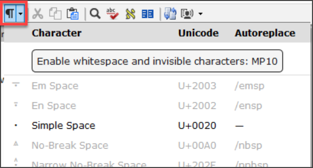
- Available in

  - Text editor, wordlist, results list, scripture reference settings and number settings
  - Character Inventory, Spell checking dialogs, Quotation rules.
- Study Bible Additions (SBA) Improvements

  - Assignments and progress
  - Figures in footnotes and sidebars
  - Scripture Reference Settings within SBA projects can now override the settings of the base project
  - Improved checking features, ensuring more accurate and efficient review processes.
- Inventories

  - Undo and redo
  - Dock Inventory panels
  - Inventory panels now consistent appearance and behaviour to Wordlist.

    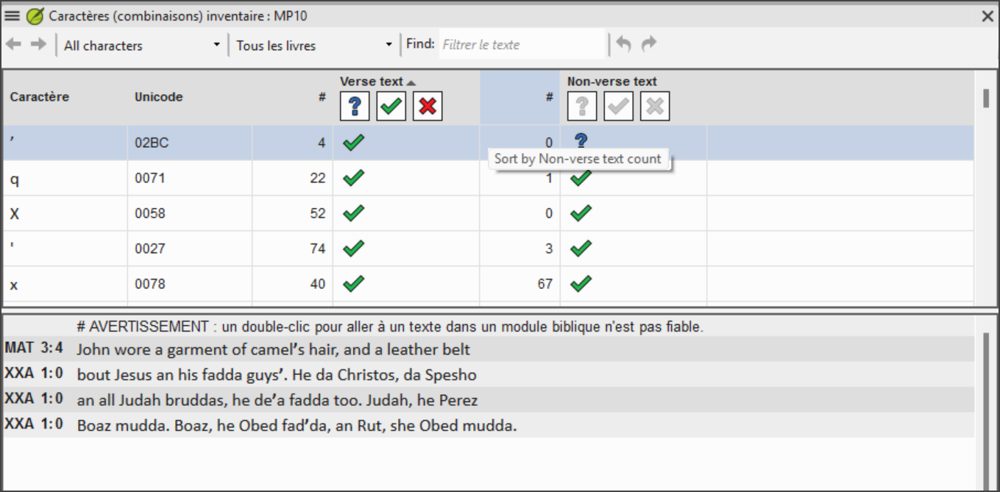
  - Approval is managed based on location - verse text, non-verse text, or study content within SBA.
  - Filtering to help find and organize inventory items.
- Additional improvements

  - Display **multiple gloss languages** in Biblical terms (Major Biblical Terms)

    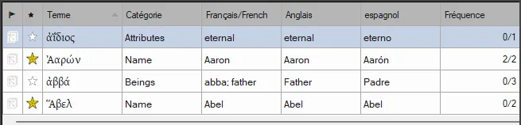
  - Filter buttons to the Download/Install resources window

    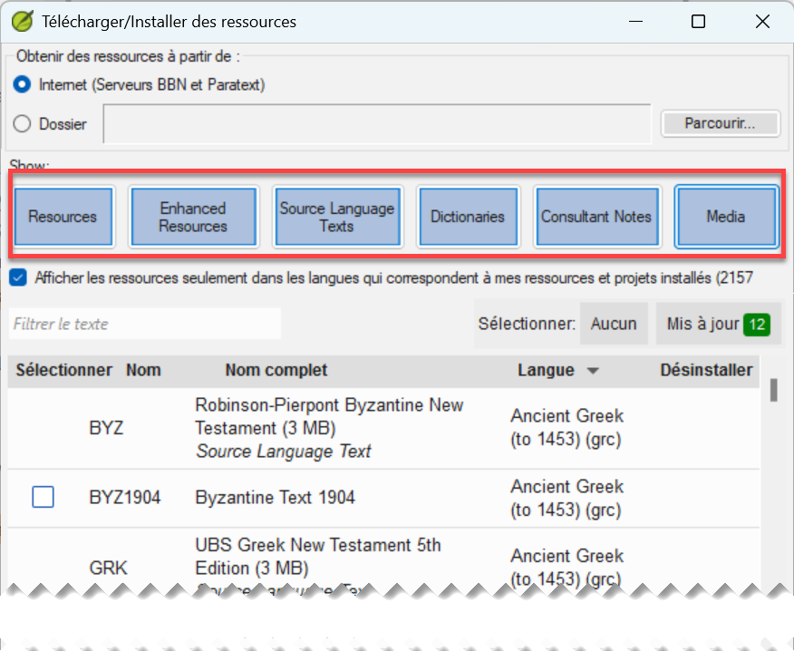
  - Simplified creating and editing Interlinearizer settings.

    - Choose from existing or click **Create New**

      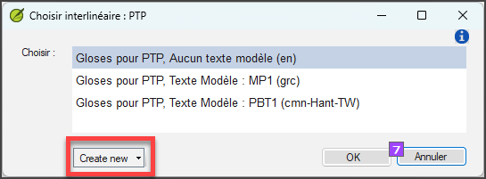
    - Choose the model text, click **save**

      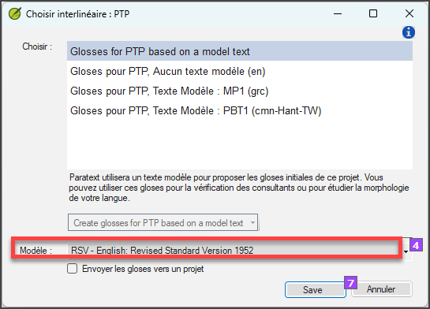
  - Project notes list - “unread and unresolved” filter

    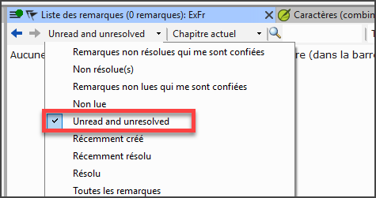

### Additional Improvements[​](#1ba598a5fd40807f8592f94edb9bef69 "Direct link to Additional Improvements")

We’ve also made these additional improvements:

- Added the ability to display **multiple gloss languages** in **Biblical Terms** windows.
- Added **filter buttons** to the **Download/Install resources** window.
- **Simplified** the process of creating and editing **Interlinearizer settings**.
- Added an **“Unread and unresolved”** filter to the **Project notes list**.
- Provided support for the new format of Flora, Fauna, and Realia in the Enhanced Resource Encyclopedia tab.
- Provided support for multi-language Flora, Fauna, and Realia.
- Added a Help link for apparatus abbreviation in GRK Source Language Text.
- Improved UI localization implementation.
- Improved merging changes for project data.
- Allowed changing inventories and settings for Transliteration projects.
- Added ability to automatically format references when Scripture Reference settings are updated.
- Provided a built-in Paratext annual survey invitation.
- Many bug fixes.

Please see the *What’s new in Paratext 9.5?* Help topic for more info about these improvements.

## Paratext 9.4[​](#192598a5fd408046bbd6d5ee536dc483 "Direct link to Paratext 9.4")

See Paratext website - [**What’s New in Paratext 9.4 Beta**](https://paratext.org/features/whats-new/whats-new-in-paratext-9-4-beta/)

Highlights

- **Notification of updates for projects on the user’s computer:** A green dot on the project menu. Settings for checking for updates are available in the **Send/Receive projects** window. [Main menu video demo](https://paratext.org/features/whats-new/whats-new-in-paratext-9-4-beta/?vimeography_gallery=157&vimeography_video=857678678)

  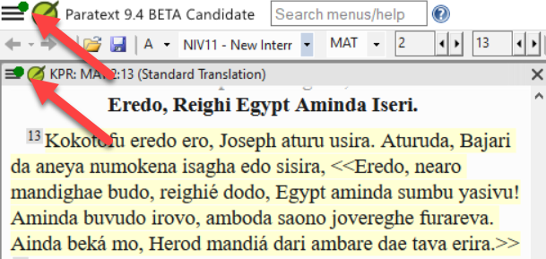
- **Notification of updates for installed resources.** A green dot in the main menu can also indicate updates to resource texts on the local computer. Access to the settings for this feature is in the **Download/Install resources**
- **Improved Right-to-Left interface.** Paratext now correctly displays right-to-left user interfaces (like Arabic). [RTL video demo](https://paratext.org/features/whats-new/whats-new-in-paratext-9-4-beta/?vimeography_gallery=157&vimeography_video=858761461)

  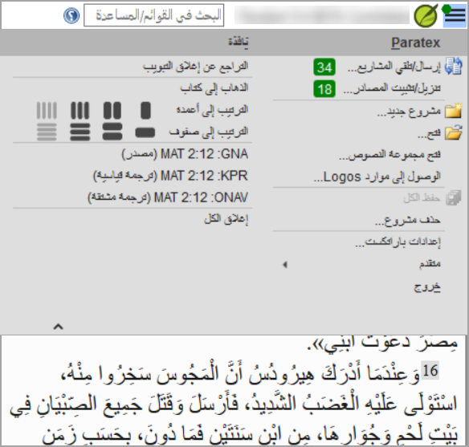
- **Option to hide project notes.** Access from the **View menu > Show Project Notes**. [Project menu video demo](https://paratext.org/features/whats-new/whats-new-in-paratext-9-4-beta/?vimeography_gallery=157&vimeography_video=857939433)

  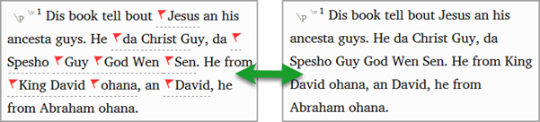
- **Improved quotation checking.** The new “Quotation Types” Basic Check knows where quotations should occur in the text based on [Glyssen](https://software.sil.org/glyssen/) data and can ensure that they are all marked appropriately. [Quotation types video demo](https://paratext.org/features/whats-new/whats-new-in-paratext-9-4-beta/?vimeography_gallery=157&vimeography_video=859138745)
- **Added video to Enhanced Resources.** Now the Media tab for Enhanced Resources contains video clips from [LUMO](https://lumoproject.com/) and UBS’s “Bible Lands as Classroom” series. [Enhanced resources videos – video demo](https://paratext.org/features/whats-new/whats-new-in-paratext-9-4-beta/?vimeography_gallery=157&vimeography_video=858761461)
- **Import/Export Biblical terms lists.** Allows users to create and exchange the Biblical Terms lists as the project progresses. [Biblical terms video demo](https://paratext.org/features/whats-new/whats-new-in-paratext-9-4-beta/?vimeography_gallery=157&vimeography_video=858020833)

**And Many More Improvements!**

## Paratext 9.3[​](#4c850f9665ff4ab8870f1ae0fed0e870 "Direct link to Paratext 9.3")

[What’s new in Paratext 9.3](https://paratext.org/features/whats-new/whats-new-in-paratext-9-3/)

### Paratext Live uses a couple of servers[​](#14973ac6c79843a3a94db72e3348418d "Direct link to Paratext Live uses a couple of servers")

- Paratext 8, 9.0 and 9.1 use a server called Internet (secondary) WCF and Paratext 9.2 uses Internet (primary) AMQP.
  - *This is why you can't use Paratext Live with 9.2 and 9.1 at the same time*
- In Paratext 9.3 when you start Paratext live you choose what server you want to use.
  - **Internet (primary)**, which is 9.2 and 9.3.
  - **Internet (secondary)** which is 9.0, 9.1 or Paratext 8.

> ℹ️ **Note**
> > ℹ️ **Note**
> > note
> 
> > ℹ️ **Note**
> > Everyone in a particular live session still needs to use the same server, it is just that from 9.3 you can work with someone on 9.1 or someone else on 9.2 (just not at the same time)

## Study Bible Additions[​](#8c8628c57aa04e48b5d33488872d0b29 "Direct link to Study Bible Additions")

The most obvious new feature the ability to **compare versions**.

1. Open a Study Bible Additions project
2. From the **Project** menu,
3. Under **Project**, choose **Compare Versions**
   - *The changes in the additions are displayed*.

## Scripture reference in navigation bar[​](#3c00a0202ad949bc8909f66660badb73 "Direct link to Scripture reference in navigation bar")

In Paratext 9.3 you can copy and paste a scripture reference into the navigation bar.

1. Copy the text of a reference (from another file)
2. Click in the **book name** in the navigation bar
3. Paste using **Ctrl+V**

   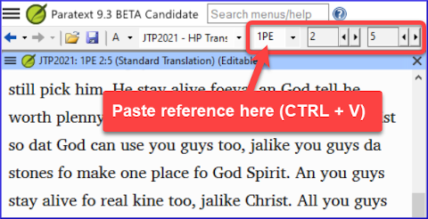

The reference should be in a format that matches the interface language.

For example,

- in English: MAT 12.3, Mrk 5:4, Galatians 1:12
- in Spanish: Romanos 8:28

> ℹ️ **Note**
> > ℹ️ **Note**
> > note
> 
> > ℹ️ **Note**
> > The names must matches the names as they are seen in the titles.
> > Currently can't copy from Paratext, but that feature is being added to a later update.

## Parallel Passages Tool[​](#f660aff19a7541efaa453398f11dbacd "Direct link to Parallel Passages Tool")

- The colours have changed from **green** to **grey (and back to green in 9.4)**
- You can reduce or expand the Greek / Hebrew by clicking the little arrow.

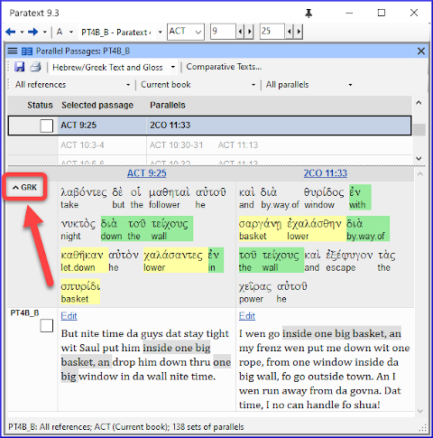

## Open a text collection[​](#fd1736d1bd07444fb6902b8dccf951dc "Direct link to Open a text collection")

There is a new menu item on the **main menu**

1. From the **Paratext menu**
2. Choose **Open text collection**

   - *This window looks like what was used in earlier versions of Paratext*.

     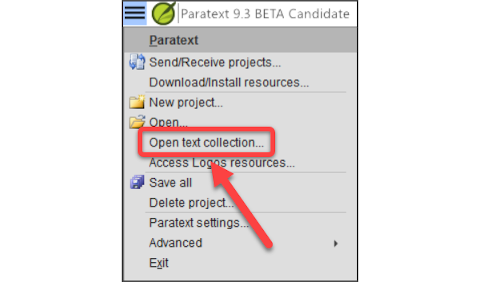
3. Open a previously **saved text collection** from the bottom left
4. You can still open a text collection from the **Open** window as well.

## Arranging windows[​](#b526a01da9e04357804f4849c39f2fdc "Direct link to Arranging windows")

- Arrange windows by **rows** as well as by **columns**.

> 💡 **Tip**
> > ℹ️ **Note**
> > tip
> 
> > ℹ️ **Note**
> > Remember to save your layout!

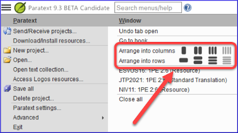

## Floating Windows[​](#493f51aae2f5480893f25897c408c26c "Direct link to Floating Windows")

- Dropdown to change the active project

  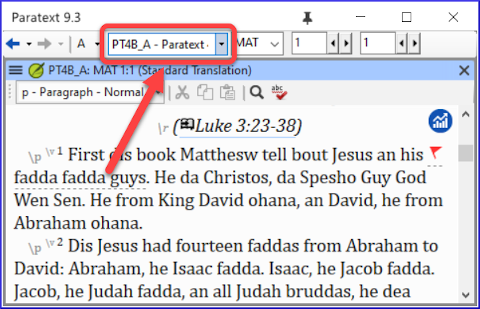

### Other new/changed[​](#4796465de7ac4f3190c47faa4b9750b8 "Direct link to Other new/changed")

- **RegEx Pal** - from Main menu > Advanced or Project menu > Advanced.
- **Synchronizing** with Logos and other compatible programs is now turned **on by default**
- Changes have been made to help with the localization of the help files and the user interface
- **Bible modules** can now handle **chapter markers** in the extra books