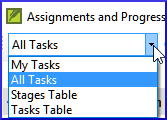
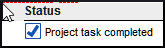
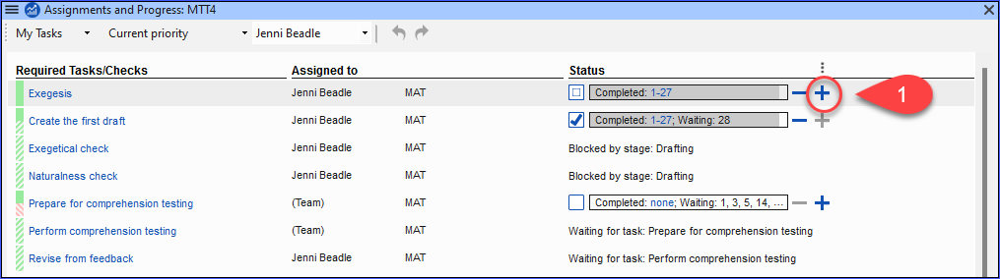
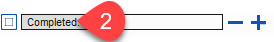
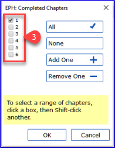

On this page

# 3. Assignments and progress

**Introduction** You use the Assignments and Progress to help organise your work and to see which tasks to do next. Once you have finished the task, you should mark it as completed so that you can report on what has been achieved. [If you have used an earlier version, you will see that it has dramatically improved in Paratext 9.]

**Before you start** Before you can use the plan, it must have been configured. [Your project administrator who will add the appropriate organisational plan and configure it for your team.]

**Why is this important?** There are so many tasks to do in a translation project. It is important to have a system to make sure you do all these tasks. Now that your plan has been configured, you can use the plan to see what tasks have been assigned to you to do next. When you finish the task, you can mark the task as completed and see the next task to do. You can use this information to generate reports for supervisors and donors (see [Project progress 2](/6.PP2)).

**What are we going to do?** You will mark a variety of tasks as complete. The exact steps will vary slightly depending on whether you do the task once per project, once per book, or by chapter. The place to mark progress for all types of tasks is the Status column.

## 3.1 View tasks that need to be done[​](#85dfcb5c87ec4d4ba3afad5489b6d5c4 "Direct link to 3.1 View tasks that need to be done")

- In your project, click **Assignments and Progress** button

OR

- [**≡ Tab** under **Project** menu, select **Assignments and progress**]

- From the first dropdown menu, choose either **My tasks** or **All tasks**
  - *A list of the various tasks and checks are displayed.*

> **Tip:** You can see more details on any task by clicking on the name of the task.

## 3.2 Identify the next task[​](#11b807d65f9a45c8a9da4cd5f798fdb2 "Direct link to 3.2 Identify the next task")

The list of tasks shows the uncompleted tasks, each with a colored bar beside it.

1. Identify the next task for you need to do. It will have either a green or slashed green bar.
2. Check that it is not waiting for another task. In this case it will have a red slash bar.
3. Do the task (see other modules if necessary).

> **Tip:** When you finish the task, see the instructions below to mark it as completed. (A check is completed when there are 0 issues.)

## 3.3 Mark a task as complete[​](#1e10472de6644e289a8dfb9d8ccde488 "Direct link to 3.3 Mark a task as complete")

### Mark a book task as completed[​](#03059c2408d64c30baf38c460e0813ff "Direct link to Mark a book task as completed")

- Click on the checkmark to the left of the status.
  - *It should turn solid to show it is completed.*

### Mark a chapter task as completed[​](#dabedb60bf4143888eb08c8f457c7598 "Direct link to Mark a chapter task as completed")

1. Click **+** to mark the next chapter as complete
2. To mark other chapters as complete you can click on the word **Completed [2]**

   

   - *A dialog box is displayed with a list of the chapters*.

     
3. Click the numbers of the chapters that have been completed [3].
4. Click **OK**

## 3.4 Checks[​](#3aa5683d6c7e41f588d4b15d4c498689 "Direct link to 3.4 Checks")

- If the task is a check, the status of the check will either say **Setup required** or it will show the number of remaining **issues**.
- A check is complete when there are **No issues**.

### Checks – setup required (Administrator)[​](#cf9cddb209dd432c92295e5baed75ecc "Direct link to Checks – setup required (Administrator)")

1. Click the blue link, "Setup required"
   - *Paratext 9 will run the appropriate inventory or open the settings for that check.*
2. Complete the setup as appropriate.
3. Close the window when finished.

> **Tip:** If there is more than one inventory required for a check (e.g. capitalization), you will need to set them up manually from the Tools menu > Checking Inventories.

### Checks – issues[​](#86edf92b36dd43a7af95a16dcf743313 "Direct link to Checks – issues")

1. Click on the blue link “…issues”
   - *A list of errors is displayed.*
2. Make the necessary corrections.
3. Close the list result (if desired).
4. **≡ Paratext** under **Paratext** > **Save all** (or **Ctrl**+**s**).
5. Return to the Assignments and Progress.

> **Tip:** The check is considered complete when there are 0 issues. If you are unable to complete a check, it is possible to postpone the check to a later stage.

### Postpone check[​](#110391bc0b9647129c47c1ccdebf2ac4 "Direct link to Postpone check")

1. **≡ Tab**, under **Project** menu, select **Assignments and Progress**
2. Change to **All tasks** view
3. Hover over a check that has issues
4. Click **Postpone** (which appears to the right of the Status column),
5. Choose which stage you want to postpone the check
6. Type the reason for postponing the check.
   - *The check will move to that stage.*