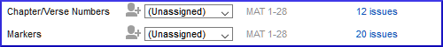

On this page

# 5. Basic checks 1

**Introduction** In this module, you will check the chapters/verses and the markers using two methods: The Assignments and Progress and the project menu (4a.Checking).

**Before you start** You must have already typed some text in Paratext 9. Now you want to start checking. In this module we start with the first two basic checks. The remaining checks are covered in [Basic Checks 2](/12.BC2) and [Basic Checks 3](/19.BC3).

**Why this is important** These checks allow you to be sure that you have all the chapters and verses and that the other markers are correct. It is important to run the chapter/verse check first because all the other checks depend on it. Doing these checks allows you to complete the Drafting stage.

**What you are going to do** You are going to run the first two basic checks using two different methods. The easiest way is to run the checks from the Assignments and Progress. However, you can also do the checks from the project menu **(Tools)** if you need to check more than one book at a time.

## 5.1 Running checks from the Assignments and Progress[​](#28ad38164bcc4c688e8e4d2f4a392b64 "Direct link to 5.1 Running checks from the Assignments and Progress")

It is easier to run the checks from the Assignments and Progress.

### **View and correct errors**[​](#8dab705513394c93b89c6f71228b4783 "Direct link to 8dab705513394c93b89c6f71228b4783")

1. View the Assignments and Progress by clicking on the **blue icon** (at the top right of your project window).

1. If there are any "issues" (errors), click the blue link to the right

   

   - *A window appears with a list of the errors*.
2. Double-click a line in the list.
3. Correct the error in your project.
4. Double-click the next line in the list.
5. Continue for each error.

### **Confirm that the errors have been corrected**[​](#648ac1a433e748dd82299215b61cb8b3 "Direct link to 648ac1a433e748dd82299215b61cb8b3")

1. Click **Rerun** button.
   - *A results list shows any remaining errors*.
2. Fix any errors
3. Close the results list window (if desired).
4. Return to the **Assignments and Progress**
5. Click on the link to show the issues from the markers check.

> **Tip:** When you have finished with a check, some people like to close the results list, others like to keep it open particularly if it changes your window layout. You can also move it to a tab of another window.

> ℹ️ **Note**
> > ℹ️ **Note**
> > info
> 
> > ℹ️ **Note**
> > Watch the video [How to use Checking Tools](https://vimeo.com/127298551)’ for examples of how to correct some common errors.

## 5.2 Running the checks from the menu[​](#3d7c1c2bb72b412c84fa0be8315c0899 "Direct link to 5.2 Running the checks from the menu")

If you want to check more than one book at a time, you can run the checks from the project menu **Tools** menu.

### Chapter/ Verse[​](#ac301c02271b4d2cbe873464d1494925 "Direct link to Chapter/ Verse")

Find the errors

1. Click in your project window
2. **≡ Tab**, under **Tools** > **Run Basic Checks**
3. Check only **Chapter/verse numbers**
4. Uncheck any other checks
5. If necessary, click **Choose…** and choose the book(s) you want to check
6. Click **OK**
   - *A results list window appears with a list of the errors.*

### Correct the errors[​](#2724585e15974d88b2f788b23d7711dc "Direct link to Correct the errors")

1. Double-click a line in the list.
2. Correct the error in your project.
3. Double-click the next line in the list.
4. Continue for all the errors.
5. Click **Rerun** button to check that all the errors have been corrected.
6. Close the results list window, if desired.

### Markers check[​](#b9296e794a82435ca258a466eb7c9ee4 "Direct link to Markers check")

The markers check displays an overview of the markers in your text. You cannot change anything, but you can look for markers which may be errors.

1. **≡ Tab**, under **Tools** > **Checking Inventories** then **Markers Inventory**
   - *The list is displayed showing an overview of the markers in your text*.
2. Review the list for markers (see below)
3. Close the marker inventory (if desired).
4. **≡ Tab**, under **Tools** > **Run Basic Checks**
5. Check the **Markers**
6. Click **OK**
7. Correct any errors.

> ℹ️ **Note**
> > ℹ️ **Note**
> > info
> 
> > ℹ️ **Note**
> > What to look for. Markers that only occur a few times. Similar markers \q and \q1. Markers that appear together but do not have the same count (e.g. \f and \f\*).