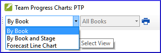

On this page

# 6. Project progress 2

**Introduction** In this module, you will learn how to update your progress by marking tasks as completed. You will also create a progress report.

**Before you start** You have been working on your translation and have finished a task. You now want to update your progress.

**Why this is important** For the Assignments and Progress to work well, you need to mark the tasks you have finished. This allows Paratext 9 to make the next task available for the other team members. It also gives Paratext accurate information on your progress for the reports. Creating a progress report helps you prepare a report for your supervisors and funders.

**What you are going to do** You will open the assignments and progress window and update the progress made. You will then produce a report.

## 6.1 Make sure the progress of the plan is up-to-date[​](#1baa7ce081654a3a9aa755bf4ebdfc4d "Direct link to 6.1 Make sure the progress of the plan is up-to-date")

1. Open the Assignments and Progress (the blue button)
2. Update the progress on all tasks (see [3. Assignments and Progress](/3.PP1) for instructions on each type of task).

## 6.2 Change an assignment[​](#420f3c9ae4d6494d8246e72237cc8030 "Direct link to 6.2 Change an assignment")

> **Warning:** You can only do this if you have **progress permissions**.

1. From the **≡ Tab**, under **Project** menu, select **Assignments and Progress…**
2. From the first drop-down list at the top left of the dialog, select **All Tasks**.
3. In the **Assigned to** column, use the drop-down list to choose who will have responsibility for the task or check (listed in the **Task/Check** column at the far left).

## 6.3 Produce a Project Health Report[​](#5164035c401f4b409f6e8addbc7d0167 "Direct link to 6.3 Produce a Project Health Report")

1. From the **Project** menu, select **Project Health Report…**.
2. Choose the project(s) to report
3. Click **OK**.
   - *The report will contain a column for each project you selected.*

## **6.4 View team progress charts**[​](#6d88f283bc7643daa88084ac0d8a055f "Direct link to 6d88f283bc7643daa88084ac0d8a055f")

- From the **≡ Tab**, under **Project** menu, select **Progress charts…**

  

1. Use the first dropdown box to choose the type of chart
2. Choose the books as necessary.
3. Click the print icon
   - *A window opens*
4. Click the **Print** icon
5. Choose your printer (or PDF printer)
6. Click **OK**.