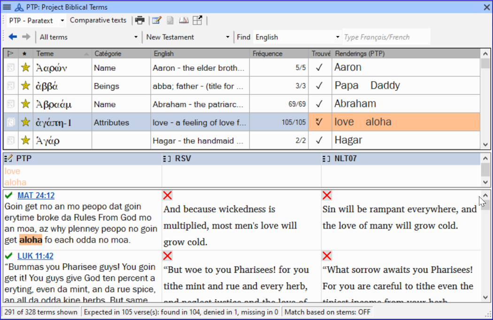
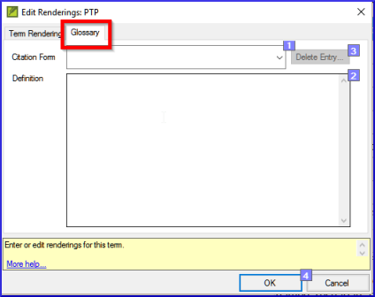
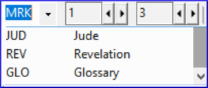

On this page

# 9. Glossary

**Introduction** This module explains how to add entries to the glossary using the **Biblical terms** tool.

**Before you start** You have drafted and entered your text in Paratext 9. Now you will add some glossary entries to explain some of the terms.

**Why this is important** It is good to have a list of important words and their explanations so that the readers can understand the text well. Rather than typing directly into the glossary, it is better to use the **Biblical terms** tool as it keeps the Glossary in alphabetical order. The tool also keeps track of the changes to the glossary.

**What you are going to do** You will use the Biblical terms tool to add a rendering for the term and then use the glossary tab to enter the citation form and the definition.

There are four training videos available on [adding](https://vimeo.com/manage/videos/451195974), [linking](https://vimeo.com/manage/videos/499553868) and [editing](https://vimeo.com/manage/videos/503489533) and getting [permission to edit](https://vimeo.com/manage/videos/476293601) glossaries. (P9 1A.4a-d).

## 9.1 Open the Biblical Terms tool[​](#137d8af8c8314fdba16891790c49c178 "Direct link to 9.1 Open the Biblical Terms tool")

1. Within Paratext, move to a verse which contains the word(s) you want to add to the glossary.
2. Right-click and choose **View Biblical Terms**, then **Current Verse(s)**
3. Check that you have the correct list open (e.g. your project list or the NT Key Biblical Terms [SIL])

   
4. To change the list, from the **≡ Tab**, under **Biblical terms** menu choose **Select Biblical terms list.**

> ℹ️ **Note**
> > ℹ️ **Note**
> > info
> 
> > ℹ️ **Note**
> > If the Biblical Term is not on either list, ask your Administrator to add the Biblical term to your project list.

## 9.2 Add an entry[​](#99fd9ee0be454494b0e01a773eee6f96 "Direct link to 9.2 Add an entry")

1. Double-click on the term in the list in the top pane
2. Click the **Glossary** tab
3. Type the citation form of the term (i.e. the way you want it in the glossary) [1]
4. Type the Definition [2]
5. Click **OK**

   - *The word(s) and the definition will be added to the glossary in alphabetical order.*

## 9.3 Link an existing entry[​](#b9f4ff025225434cbba15665f0894328 "Direct link to 9.3 Link an existing entry")

> **Tip:** If the word is already in the glossary, you can link a Biblical term to the existing entry in the glossary. Later in stage 6 you will link the Biblical term to the text to add the \* in the printed text or the link in the electronic app.

### Find the Biblical term[​](#120bd663b5ff4b7a840f4ef3c26b06d8 "Direct link to Find the Biblical term")

1. From the **Biblical Terms** tool
2. Check that you have the correct list open (e.g. your project list or the NT Key Biblical Terms [SIL])
3. Double-click on the word in the list in the top pane

### Link to glossary entry[​](#dd6a347260a34a9ab7c52f8b91f9b165 "Direct link to Link to glossary entry")

1. Click the **Glossary** tab
2. Click the down arrow near the citation form [1]
3. Choose the entry from the glossary
4. Click **OK**

## 9.4 View the glossary[​](#ebf2c2a15ff946199b5764dfe7af56a8 "Direct link to 9.4 View the glossary")

In Paratext

1. Use the navigation bar to change the book
2. Choose the **GLO** book

## 9.5 Edit an entry – in the GLO book[​](#059626f045a34c24bcdd466553c8e18a "Direct link to 9.5 Edit an entry – in the GLO book")

In Paratext

> **Tip:** It is recommended to use the Biblical Terms tool to work on glossary entries. However, it can be useful to edit the definitions from the GLO book.

1. Open the **GLO** book
2. Edit the text as normal.

## 9.6 Edit an entry – in the Biblical Terms[​](#b1ea5eaaee78499bbffe70a892a4ce81 "Direct link to 9.6 Edit an entry – in the Biblical Terms")

1. **≡ Tab**, under **Tools** > **Biblical terms…**
2. Double-click on the word in the list in the top pane.
3. Click the **Glossary** tab
4. Edit the definition
5. Click **OK**.

> ℹ️ **Note**
> > ℹ️ **Note**
> > PARATEXT 9.3
> 
> > ℹ️ **Note**
> > You can now edit the citation form in this tab without breaking the link to the entry.

## 9.7 Add a Biblical Term[​](#717471a3fbf3477fbab8e730af1b1ad7 "Direct link to 9.7 Add a Biblical Term")

- see the section [**10.7 Add a term – from reference text search**](/10.BT#f683ccf4cdcf45f09c516c09c78ab277)

## 9.8 Recall[​](#2843edbecf5e4950944e24a78538bc99 "Direct link to 9.8 Recall")

- You can open the Biblical Terms tool from the ***\_\_*** menu.
- The **Glossary** tab is on the **\_** dialogue. To open this dialogue you **\_-click on the term in the \_\_** pane.
- To view the glossary, you change to the **\_** book (after Revelation).

> ℹ️ **Note**
> > ℹ️ **Note**
> > info
> 
> > ℹ️ **Note**
> > [Answers: right-click, Edit Rendering, double, top, GLO]