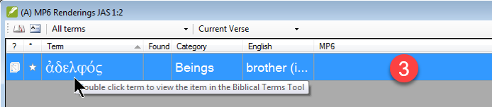
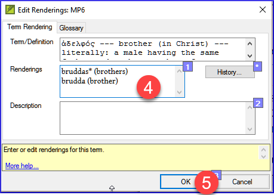
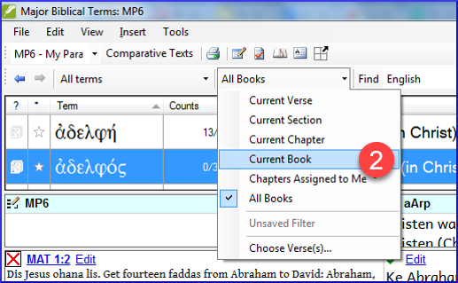
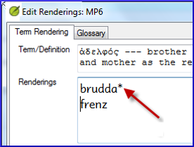
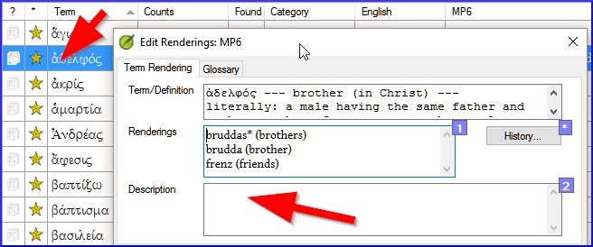
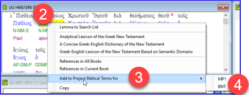
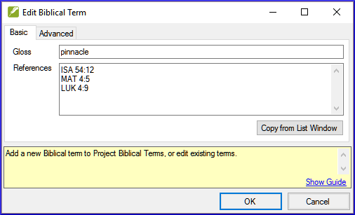

On this page

# 10. A 4-Step process for consistent Biblical Term

**Introduction** The *Biblical terms rendering* window and the separate *Biblical terms* tool are very useful to make sure you are consistent in the use of terms, especially key terms. With many terms over many books this can become quite a task. This module explains a simple 4-step process to make your Biblical Terms consistent. You should consider this process as part of the translation process and not a check.

**Before you start** You are translating a verse in Paratext 9, and you want to see what renderings you have already chosen for the terms in the current verse, and then make sure they are consistent with other verses.

**Why this is important** For your readers to understand your text, you need to be consistent in your use of terms. It is a big task to make them completely consistent. If you start from the verse you are translating and work from there the task is more manageable. The goal is to have consistently rendered Biblical Terms and well-documented decisions on why you made the changes.

**What you are going to do** This method boils down to a short list of steps:

1. **[A]** Find all the ways you have rendered this term, and enter them in the renderings dialog.
2. **[B]** Choose which rendering is/are best, and record why it is best.
3. **[C]** Document why you rejected the other renderings.
4. **[D]** Clean up your translation by making this rendering consistent throughout your translation. (Make Consistent, Standardise, Normalise, Harmonise).

- Repeat with next Biblical Term you find in the Biblical Terms Renderings window.
- You will also use the new Paratext 9.4 feature to export terms from the Biblical terms list and share it with your colleagues.

## 10.1 Open the Biblical terms rending window[​](#f8f57567e6ff4b9193367abfbee7302a "Direct link to 10.1 Open the Biblical terms rending window")

1. Click in your project
2. **≡ Tab**, under **Tools** > **Biblical terms rendering**
3. **≡ Tab** (of the new window), under **Biblical Terms** > **Select Biblical terms list**
4. Choose the desired list
5. Click **OK**.

## 10.2 A: Find all the ways you have rendered this term[​](#df4c8121b667426ca013ce2feace7348 "Direct link to 10.2 A: Find all the ways you have rendered this term")

### Find the terms for the current verse[​](#3ffdc542c5f84c369b2c4cdfcc8569e1 "Direct link to Find the terms for the current verse")

- Is there a tick/checkmark in the found column?
- If there is a tick/checkmark, your verse uses the term, and you can continue with the next term.
- If not, you need to either correct your text or add the new term you have used (see below).

### Add another rendering[​](#dae5da6bfb1b40c99e9eb4f0c7fe1f06 "Direct link to Add another rendering")

If the term you have used is not on the list, you can add it:

1. Select the rendering of the term in your text.
2. Copy it (**Ctrl**+**C**)
3. Double-click in the renderings cell of the Biblical Terms rendering window.

   - *The edit renderings dialog is displayed*.
4. Paste (**Ctrl**+**V**) the rendering in the dialog box.
5. Click **OK**.

### Find other verses in the current book with the same Biblical term[​](#bbdc4762638048adb945ccfff0f3c9e3 "Direct link to Find other verses in the current book with the same Biblical term")

In the Biblical Terms rendering window

1. Double-click on a word in the **Term** column

   - *The Biblical Terms Tool opens*
2. From the second filter button choose **current book**
3. Add renderings for the term in the verses until you have identified the terms in all those verses (see below).

### Add renderings from the other verses[​](#a5212cc460da4fabb7cb3db81d405280 "Direct link to Add renderings from the other verses")

1. Select the rendering in the verse
2. Add the rendering using **Ctrl**+**A**
3. Continue until you have identified the terms in all those verses.

### Dealing with verses that do not use the term[​](#3867de64e3064e85a08eed2cdab64dad "Direct link to Dealing with verses that do not use the term")

> **Tip:** There are times when a verse is translated without using the actual term. For example, when you use a pronoun. In this case you need to deny that it is an error.

- Click the red cross to the left of the verse reference link
  - *The red cross turns into a green tick with a small red x*

> **Warning:** If you click on the cross by mistake, click the green tick and it will return to the red cross.

## 10.3 B: Identify the best term[​](#55582923eae649c9964c1e0068ec29ac "Direct link to 10.3 B: Identify the best term")

1. Double-click on the term in the top pane.

   - *The edit rendering dialog is displayed listing all the renderings you added.*

     
2. Decide on the best rendering
3. Select, then Cut (**Ctrl**+**x**) and paste (**Ctrl**+**v**) it to the top of the dialogue box
4. Add **\*** as necessary to combine similar renderings

> **Tip:** You can use **\*** in a number of different ways: before the word for prefixes and after the word for suffixes. You can also put an **\*** in the middle of a word. See the guide for more ways of using the **\***.

## 10.4 C: Reject all the others[​](#91a3dcb7525c41919b79cdc020e1ca63 "Direct link to 10.4 C: Reject all the others")

- Select and cut the other renderings.

## 10.5 D: Document the reason for the change[​](#c70df72e555f44d4a73cd41076bd8718 "Direct link to 10.5 D: Document the reason for the change")

- Click on the **History** button

- Type in the reason why you rejected the others and why the first was the best.
- Click **OK**

### If you need more than one rendering[​](#7efa68af7a544631bf7f24302fa0449e "Direct link to If you need more than one rendering")

> **Tip:** You can add more than one rendering if appropriate. It is good to add a back translation in brackets after the rendering. For example,
> > slave (slave)
> > guy \* work fo (guy that works for)

1. Open the Edit renderings dialog box
2. Edit the renderings as needed.

### Clean up other books (as time permits)[​](#ad15f3d2b6c24b35a1bb0ef7a8c04731 "Direct link to Clean up other books (as time permits)")

1. Change the filter so that all the published books are displayed.
2. Clean up verses as necessary.

### Add the Biblical terms notes — ongoing discussion[​](#90110e260d7c40ca81c55c8e3604926b "Direct link to Add the Biblical terms notes — ongoing discussion")

1. Double-click on the note icon (in the second column)

   
2. Type in the note
3. Assign the note as necessary.
4. Click **OK**.

### Add the decision to the renderings description[​](#1d89b36b75b14ab2a712924ef0e101e5 "Direct link to Add the decision to the renderings description")

1. Double-click on the term
2. Type the agreed-on rendering in the description field
3. Click **OK**

## 10.6 Add a term – from the source language text[​](#1ec5422db83c4bdeb51842a53f7df352 "Direct link to 10.6 Add a term – from the source language text")

> **Tip:** You can create a list of verses for a specific Greek/Hebrew word and then use that list to add the word/phrase to your project Biblical terms list.

1. Click in the window with the Source text.

   
2. Right-click on a lemma (blue word) in the source language text window
3. Choose **Add to project biblical terms for**
4. Then choose your project
5. Edit the gloss if necessary
6. Click on the **Advanced** tab
7. Edit the terms if necessary
8. Click **OK**

### View the new term[​](#f269fc949f124cd5b1b68bb9a60766ad "Direct link to View the new term")

1. Change to the **Biblical Terms Tool**
2. Double-click on the term.

## 10.7 Add a term – from reference text search[​](#f683ccf4cdcf45f09c516c09c78ab277 "Direct link to 10.7 Add a term – from reference text search")

> **Tip:** There will be terms which are important for your language and culture that are not in the list. You can add these terms to your project list.

In Paratext

- From your reference text, do a find (using **≡ Tab**, under **Edit** > **Find**) and search for the term.
  - *A list is displayed showing the verses with that term.*

From the list of results

1. **≡ Tab**, under **Edit**> **Add to Project Biblical Terms**, then choose your project
2. Edit the gloss if necessary
3. Click on the **Advanced** tab
4. Type in a name for the term
5. Click **OK**

## 10.8 Share a Biblical Terms List (optional)[​](#b6ca108e1c374004b5acb581e61ebecc "Direct link to 10.8 Share a Biblical Terms List (optional)")

> ℹ️ **Note**
> > ℹ️ **Note**
> > Upgrade
> 
> > ℹ️ **Note**
> > In Paratext 9.4, you can import or export terms from a Biblical Terms list. You can then share that exported list with your team members. Here is an overview. For more details, watch [What’s New in Paratext 9.4 Biblical Terms](https://vimeo.com/858020833)

1. From the **≡ Project**, Open **Biblical Terms**
2. Select or filter the desired terms
3. From the **≡ Tab**, choose **Export Filtered Biblical Terms**
4. Type a name for the file
5. Share the file with a colleague.
6. They can open the shared list, **≡ Tab**, choose **Import Filtered Biblical Terms list** in the Biblical Terms tool.