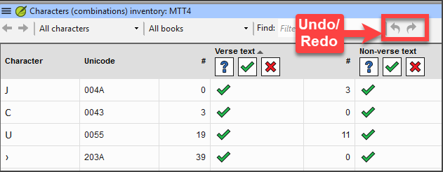
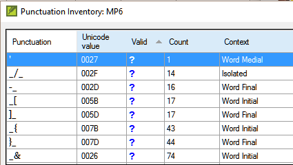

On this page

# 12. Basic Checks 2

**Introduction** In this module, you will learn to do several other basic checks (**Characters**, **punctuation**, **capitals**, and **repeated words)**. As in the first Basic Checks module (5. [Basic checks 1](/5.BC1)), it is easiest to run these checks from the Assignments and Progress. However, if you want to check several books, you will need to use the **Tools** menu.

**Before you start** You have typed your translation in Paratext 9. Be sure that you have checked the chapter/verse numbers and markers, as described in 5. [Basic checks 1](/5.BC1), before continuing and that your administrator has either completed the setup of the checks or is with you to do the setup now.

**Why is this important?** Paratext 9 has eleven **Basic Checks**. You have already seen the first two, chapter/verse numbers and markers. This module will help you to find errors linked to characters, punctuation, capital letters and repeated words. Even though these errors may not influence the content of the text, correcting them makes the text easier to read.

**What we will do:** Most of the checks require that your administrator has completed an inventory. In this module, you will

- Confirm that someone has done the setup (or have the administrator do the setup)
- do the Basic Checks
- correct any errors.

## 12.1 Confirm the setup[​](#96b5c12dac164c719816a72af9b6bdea "Direct link to 12.1 Confirm the setup")

Before you can run these other basic checks, someone must set them up. Some checks require an inventory, and others require rules or settings.

> **Warning:** You can do most of the inventories, but **only your Administrator** can do the rules or settings.

## 12.2 Changes to inventories[​](#1ba598a5fd408085bb05d1fb347c38e9 "Direct link to 12.2 Changes to inventories")

> ℹ️ **Note**
> > ℹ️ **Note**
> > info
> 
> > ℹ️ **Note**
> > In Paratext 9.5, the inventories have changed. They now look and behave like the Wordlist panel. A new feature allows you to approve an item based on its location. That is, you can now approve an item based on whether it is in verse text or non-verse text.
> > 
> > - Click on the Inventory menu and choose “Set verse and non-verse status separately”.
> > 
> > 

- there are an undo and redo icons (top right)
- **filtering** to help users easily find and organize inventory items.
- inventory panels can also be docked

## 12.3 Using inventories to setup[​](#2af0f49b3c8248368dd82611ad6daed7 "Direct link to 12.3 Using inventories to setup")

> **Tip:** These inventories show what is currently in your text, that is, both the good and the bad. You need to work through the inventory and tell Paratext 9 which elements are correct (valid) and which are errors (invalid).

Once you have finished the inventory, you will be ready to check.

1. From the **≡ Tab**, under **Tools** > **Checking inventories** menu, choose the appropriate inventory (for example, Character inventory).
2. Click on an item in the list in the top pane.
   - *The verses are shown in the bottom pane.*
3. For each item in the top pane, choose either **Valid** or **Invalid**.
4. Repeat for each item.
5. Click **OK**.

> **Tip:** Instead of using the mouse, you can use **Ctrl** + **y** to mark an entry as **Valid** or **Ctrl** + **n** to mark an entry as **Invalid**.

## 12.4 Characters[​](#62a1b14481984178905fe3720ad81e98 "Direct link to 12.4 Characters")

> **Tip:** This check (and inventory) helps you identify all the incorrect characters, i.e. the characters that are not in your alphabet (as defined in the language settings **≡** Tab, under **Project Properties** > **Language Settings** > **Alphabetic characters**.

### Setup required[​](#e87d6701d2f546faa45b5584b3b45d3a "Direct link to Setup required")

1. **≡ Tab**, under **Tools** > **Checking inventories** > **Character inventory**
2. For each item, choose **Valid** or **Invalid**.

> **Warning:** If one of your alphabetic characters is currently "Unknown", then that your Administrator should add the character to your language settings by the administrator.

### Check[​](#26d95e0dcad04a3a99dff3ea83702c82 "Direct link to Check")

**≡ Tab**, under **Tools** > **Run Basic Checks**

1. Check **Characters**
2. Click **OK**.
   - *A list of errors is displayed.*
3. Make any corrections as needed.

## 12.5 Punctuation[​](#7a03d8fd1d3d4de38e992c7820f94bc7 "Direct link to 12.5 Punctuation")

> **Tip:** This check (and inventories) helps you identify all the incorrect or misplaced punctuation marks. (Use the Unicode character column to clearly identify the punctuation.)

### Setup required[​](#21350c0dd462479184cc36dc9fc50d24 "Direct link to Setup required")

1. **≡ Tab**, under **Tools** > **Checking inventories** > **Punctuation Inventory**
2. Check each punctuation mark in its context.

   - The contexts can be:

     - **word initial**, **word medial**, **word final** or **isolated**
   - For each punctuation in its context,

     - choose **Valid** or **Non valid** or leave as **Unknown**

     
3. When finished click **OK**.
4. **≡ Tab**, under **Tools** > **Checking inventories** > **Markers Missing Final Sentence Punctuation**
5. For each item, choose **Valid** or **Invalid**.

### Check[​](#a24bedcb31944326a9c14889a7bf5a29 "Direct link to Check")

1. **≡ Tab**, under **Tools** > **Run Basic Checks**
2. Check **Punctuation**
3. Click **OK**.
   - *A list of errors is displayed.*
4. Make any corrections as needed.

## 12.6 Matched Pairs[​](#829c1d30e9d044ce9808a2a1c3ce63fd "Direct link to 12.6 Matched Pairs")

### Setup required[​](#458176d1cea940d5aa50db2af73cf078 "Direct link to Setup required")

1. **≡ Tab**, under Tools > **Checking inventories** > **Unmatched pairs of punctuation**:
2. If the list is empty, then there are no errors with these pairs of characters.
3. If necessary, click **Options…** to add other pairs

### Check[​](#b1cbb995508b4d5eb82eec2f09af40ec "Direct link to Check")

1. **≡ Tab**, under **Tools** > **Run Basic Checks**
2. Check **Unmatched pairs of punctuation**
3. Click **OK**.
   - *A list of errors is displayed.*
4. Make any corrections as needed.

## 12.7 Repeated words[​](#17ce3bddd4ed49c4afaceb8f4b874e20 "Direct link to 12.7 Repeated words")

> ℹ️ **Note**
> > ℹ️ **Note**
> > info
> 
> > ℹ️ **Note**
> > This check is to identify words that have been repeated in the text. This may indicate an error, but not necessarily.

### Setup required[​](#9d08869684634685aa5a788e974cda3e "Direct link to Setup required")

1. **≡ Tab**, under **Tools** > **Checking inventories** > **Repeated words inventory:**
2. For each item, choose **Valid** or **Invalid**.

### Check[​](#ef2ea7921ac94cbca127e812b46341dc "Direct link to Check")

1. **≡ Tab**, under **Tools** > **Run Basic Checks**
2. Check **Repeated words**
3. Click **OK**.
   - *A list of errors is displayed.*

- Make any corrections as needed.

## 12.8 Capitalization[​](#7f4309ed10a44e7cae14a3c07da88d72 "Direct link to 12.8 Capitalization")

> ℹ️ **Note**
> > ℹ️ **Note**
> > info
> 
> > ℹ️ **Note**
> > The capitalization check looks for several types of capitalization problems. There are three inventories for capitalization, but only one check. You may need to click on the **Options** button to add markers or punctuation.

### **Setup required**[​](#4ffe45925e6249d19d3c3d98f5a2a6eb "Direct link to 4ffe45925e6249d19d3c3d98f5a2a6eb")

1. **≡ Tab**, under **Tools** > **Checking inventories** > **Markers followed by a lower case letter**
2. For each item, choose **Valid** or **Invalid**.
3. **≡ Tab**, under **Tools** > **Checking inventories** > **Punctuation Followed by a Lower Case letter**
4. For each item, choose **Valid** or **Invalid**.
5. **≡ Tab**, under **Tools** > **Checking inventories** > **Mixed Capitalization**
6. If you have lowercase prefixes, click **Options** and enter the details.
7. For each item, choose **Valid** or **Invalid**.

### **Check**[​](#491e80502e594776829f3545b770e886 "Direct link to 491e80502e594776829f3545b770e886")

1. **≡ Tab**, under **Tools** > **Run Basic Checks**
2. Check **Capitalization**
3. Click **OK**.
   - *A list of errors is displayed.*
4. Make any corrections as needed.

## 12.9 Making minor corrections[​](#69410b6613db4a8b8cba359728e2caf1 "Direct link to 12.9 Making minor corrections")

> **Warning:** It is possible to make minor corrections from within a displayed inventory. However, if there are several errors it is best to run the check to make the corrections.

1. Click on a verse in the lower pane
2. Hold the **Shift** and double-click
3. Make the correction
4. Click **OK**.

> **Warning:** In some cases, it is preferable to use the Wordlist or the spell checker to correct several errors at once.

### **Review**[​](#555ab76059a54d4689dd06ae94ccb00c "Direct link to 555ab76059a54d4689dd06ae94ccb00c")

There are many basic checks in Paratext 9. The table below summarizes the setup needed for each of the checks.

| **Check** | **Setup** |
| --- | --- |
| Chapter/verse numbers | none |
| Markers | none. (Marker inventory displays all current markers) |
| Characters (Combinations) | Character inventory |
| Punctuation | Punctuation inventory Markers Missing Final Sentence Punctuation |
| Capitalization | 3 inventories Markers followed by a lowercase letter; Punctuation Followed by a Lower Case letter; Mixed Capitalization |
| Repeated words | Repeated words inventory |
| Unmatched pairs of punctuation | Unmatched pairs of punctuation inventory |
| Quotations | **≡ Tab**, under **Project Setting** > **Quotation rules** |
| Numbers | **≡ Tab**, under **Project Setting** > **Number settings** |
| References | **≡ Tab**, under **Project Setting** > **Scripture reference settings** |
| Footnotes Quotes | none |

> **Warning:** It is possible to run all the checks at once; however, when running the checks for the first time, it is better to run them one at a time to avoid a long list of errors.