On this page

# 15. Using Notes

**Introduction** As you are translating and checking you may want to make comments on various errors or issues. You may also want to record your discussions on key terms and spelling issues. Paratext 9 allows you to record these comments either in the text, the Biblical terms list or the wordlist.

**Before you start** You are typing or revising your text, wordlist or Biblical terms and need to make comments on an issue you have seen.

> **Warning:** Notes and footnotes are very different. Footnotes are printed in the New Testament whereas notes are for questions and comments and are not printed in the New Testament.

**What you are going to do**
You will:

- add more note types (administrator only)
- create notes in the text using different icons,
- open, edit, and resolve notes
- open a notes list
- filter the list
- print a list of the notes

> ℹ️ **Note**
> > ℹ️ **Note**
> > Upgrade
> 
> > ℹ️ **Note**
> > In Paratext 9.4 there is an Option to **show/hide project notes.**
> > 
> > - **≡ Project** under **View > Show Project Notes**.
> >   - *Note icons will be either shown or hidden.*

## 15.1 Different types of project notes[​](#fe71e7bac96d4755bb40630bd0c2b1c0 "Direct link to 15.1 Different types of project notes")

You can choose from many different icons for your project notes in Paratext 9:

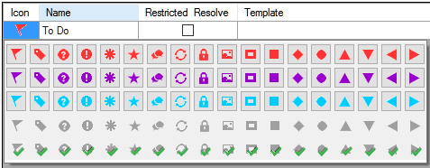

> **Tip:** Don't have too many icons!

**An icon can have four different colours or shapes**

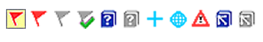

| Description | Meaning |
| --- | --- |
| Icon has a **border** and a **yellow background color**. | The note has at least one unread comment. |
| Icon is r**ed, purple,** or **light blue**. | A project note assigned to you, or to the whole team, or unassigned. |
| Icon is **gray**. | A project note assigned to someone else. |
| Icon is **gray** with a **green tick**. | A project note with resolved status. (This will not appear in the text, but only in the notes list.) |
| Icon is a **white question mark** on the **cover of a book**. | There is a spelling discussion note for this word. (Wordlist only.) |
| Icon is **gray** with a **question mark** on the cover of a book. | There is NOT a spelling discussion note for this word. (Wordlist only.) |
| Icon is a **light blue plus** +. | A consultant note. |
| Icon is a **light blue globe**. | A global consultant note. |
| Icon is a **black exclamation point !** within a **red triangle.** | There is a Send/Receive merge conflict because two users have made different changes to the same verse. |
| Icon is a **white arrow** on a **blue background**. | There is a rendering discussion note for this Biblical Term. (Biblical terms window or tool only) |
| Icon is **gray** with an **arrow on the cover of a book**. | There is NOT a rendering discussion note for this Biblical Term. (Biblical terms window or tool only) |

### **Setup additional note tags**[​](#04231dff267d4df992012fdcfb7f5b49 "Direct link to 04231dff267d4df992012fdcfb7f5b49")

> **Warning:** One must be an Administrator

1. **≡ Tab**, under > **Project** > **Project settings** > **Project properties**
2. Click the **Notes** tab
3. Click on the **Add** Tab button
   - *A new line is added.*
4. Click the icon on the new tag line
5. Choose the desired icon
6. Type a name for the new note type
7. Continue for any other new notes.

## 15.2 Using notes[​](#c8c21c6181cc4529a478dba32d984ba5 "Direct link to 15.2 Using notes")

**Inserting a project note**

1. Click in the text where you want the note (and select any appropriate text).
2. **≡ Tab**, under **Insert** > **Note**
3. Choose the desired tag for the note from the list
4. Type the text for the note
5. Click **OK**.

   - *An icon is displayed beside the text.*

.

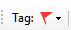

### **Add comments to an existing note**[​](#958963568fb4491bb7fedc24d80585bb "Direct link to 958963568fb4491bb7fedc24d80585bb")

- Click the icon in the text

  - *The note opens*.

    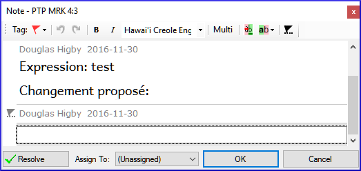

- Type a note
- Click **OK**

### **Assign a note to someone**[​](#9a602aedc3974606bf478a02d0e2015a "Direct link to 9a602aedc3974606bf478a02d0e2015a")

1. Click the icon in the text.

1. Type your comments
2. Click **Assign to**
3. Choose as desired
4. Click **OK**

### **Apply notes to multiple projects**[​](#6536405a9e4842f29a1f267c60b4337d "Direct link to 6536405a9e4842f29a1f267c60b4337d")

1. Open the note from the text
2. Click the **Multiple** button
3. Choose the projects
4. Click **OK**
5. Click **OK** again to close the dialog box.

### **Reattach note**[​](#fe4f817bb1724ed6889d543fb3f4bbc8 "Direct link to fe4f817bb1724ed6889d543fb3f4bbc8")

- Click the note icon in the text to open the note.

  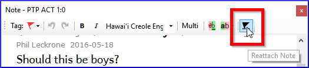

- Click the Reattach Note button (on the toolbar)

- Select the word(s) to attach it to.
- Click **OK**.
  - *The note is attached to the word(s).*

### **Resolve a note**[​](#3f7599da36934413b855ecb7e595d63a "Direct link to 3f7599da36934413b855ecb7e595d63a")

1. Click on the icon in the text
2. Type another comment if necessary.
3. Click the **Resolve** button
4. Click **OK**

.

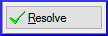

### **Delete notes**[​](#2f83955761a8491fb260cae2b8a7515e "Direct link to 2f83955761a8491fb260cae2b8a7515e")

1. Click the note icon
2. Click the small trash can
3. Click **Yes** to permanently delete your comment.
4. If there are more comments, continue to delete the next comment.

.

> **Tip:** You can only delete your own comments if they are the last in the list.

## 15.3 Open a Notes List[​](#c87dc9e1b95e46919469ec3681242fb0 "Direct link to 15.3 Open a Notes List")

When reviewing notes, it is often helpful to see them in a list.

1. **≡ Tab**, under **Tools** > **Notes list**
2. Select your project.
3. Click **OK**.

   - *A note list window opens (see below).*
4. Adjust the filters as needed.

   > 💡 **Tip**
   > > ℹ️ **Note**
   > > tip
   > 
   > > ℹ️ **Note**
   > > If the window is blank, then change the filters using the filter buttons on the toolbar (see below).

### **Notes list toolbar**[​](#16ec056e5f1a44c18f715698dcfd0baa "Direct link to 16ec056e5f1a44c18f715698dcfd0baa")

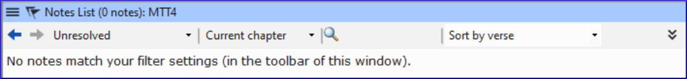

There are four dropdown boxes on the toolbar

1. Notes filter
2. Verse filter
3. Search
4. Sort by [verse, date, assigned to]

### **Notes list filter**[​](#58384e92b3154b6d87c93ea6b7fc5073 "Direct link to 58384e92b3154b6d87c93ea6b7fc5073")

- Click the first button/list
- Choose an existing filter as appropriate

> ℹ️ **Note**
> > ℹ️ **Note**
> > info
> 
> > ℹ️ **Note**
> > Paratext 9.5 added an **“Unread and unresolved”** filter to the **Project notes list**.

### **Define a new filter**[​](#ae915757c45d40c79820d8588c7173c9 "Direct link to ae915757c45d40c79820d8588c7173c9")

- Click the first button/list
- Choose **New filter**
- Choose the status, tag, person and date as desired.
- Click **OK**

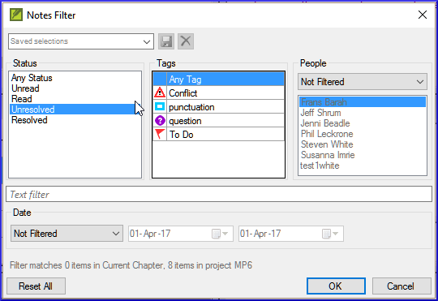

### **Save a filter**[​](#c943f2ad210e4b65b07b60a324e4331b "Direct link to c943f2ad210e4b65b07b60a324e4331b")

1. Define the filter as needed.
2. Click in the textbox at the top left (1).
3. Type a name for the filter
4. Click the save icon (2).

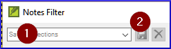

## 15.4 Add comments in the notes list[​](#229174addf7e4280a3da1b08d9b11d7c "Direct link to 15.4 Add comments in the notes list")

- Click the arrow to expand the note
  - *The note opens*

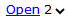

- Type your comments in the textbox.

  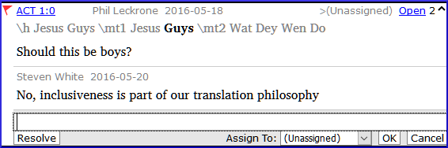
- Resolve or assign the note as needed.
- Click the arrow to collapse the note.

> **Tip:** You can also click the **Open** link to open the note window.

## 15.5 Print a notes report[​](#a6ef1b8b74ec4e569f5211f8384d8c8e "Direct link to 15.5 Print a notes report")

1. Click in a notes list window.
2. Filter the list as desired.
3. **≡ Tab**, under **Project** > **Print**
4. Choose the printer and any options.
5. Click **OK**.
6. Close the window.