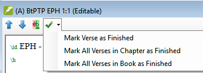
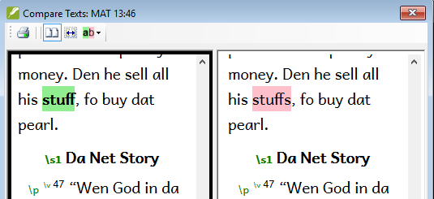
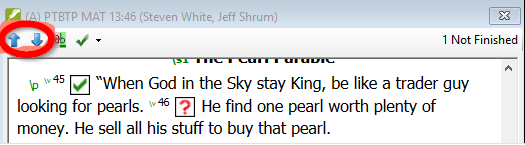
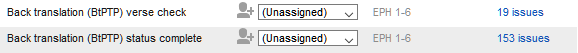
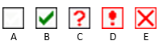

On this page

# 16. Draft a Back Translation

**Introduction** In preparing for a consultant check, the consultant will need one or more versions of your text in a language they understand. This is often called a back-translation. There are two types of back translations. This module explains how to do a free back-translation and keep it up to date. The next module explains how to do a word-for-word back-translation using the project interlinearizer.

**Before you start** You have typed, checked and revised your translation in Paratext and are now preparing for a consultant check. Before you can start, your Administrator must have created a separate project for your back translation.

**Why is this important?** You need to get your text checked by a consultant. But because the consultant does not know your language, you need to translate your text back into a language they can understand. This is where the term “back translation” comes from. The consult will use this translation to help your team improve your exegetical choices in the text.

It is preferable that someone who is not involved in your translation checks it. This way she will type what the text says and not what you meant it to say. They should not look at any helps or other Bibles.

**What will you do?**

- Open your project and back translation project
- Arrange your text on the screen.
- Draft your back translation
- Mark the status as finished when you complete a chapter.
- Check that your text is up-to-date (or in sync), view any differences by moving to the next change if appropriate.

> ℹ️ **Note**
> > ℹ️ **Note**
> > Upgrade
> 
> > ℹ️ **Note**
> > Your project is the base project of your back translation project. In 9.4, you can now open your project from the back translation (**≡ Project** choose **Open base project …**).

## 16.1 Create a new project for the back translation[​](#44530c9822fc4c2d9677cc06c747491c "Direct link to 16.1 Create a new project for the back translation")

> **Warning:** The project is created once by an Administrator. If a project exists see [16.2 below](/16.BT1#e6cb21ddb31146938d0576ea7f4f3b06).

- **≡ Paratext** under **Paratext** > **New Project**

### **Enter the names for the project**[​](#c929f129f8d848d890d32d1ed85ed86a "Direct link to c929f129f8d848d890d32d1ed85ed86a")

- Click **Edit**
- Type a full name for the project and a short name
- Click **OK**

### **Choose the settings** **of the project**[​](#2db659565b714589be113884683c1f1f "Direct link to 2db659565b714589be113884683c1f1f")

1. Choose the language for your back translation (e.g. English)
2. Leave the versification
3. For the Type of project choose **Back Translation**
4. For **Based on** choose your project
   - *If necessary, Paratext will change the versification to match your project.*
5. Click **OK**
   - *The new project opens with links to Create book(s) or Import book(s)*.

> ℹ️ **Note**
> > ℹ️ **Note**
> > info
> 
> > ℹ️ **Note**
> > This project does not need to be registered, as it inherits the registration from your project.

### **Create books**[​](#53659e0ab6c34a939d0e69dcdfd786e4 "Direct link to 53659e0ab6c34a939d0e69dcdfd786e4")

- Click the **Create Book(s)** link
- Create books as needed.

> **Warning:** Use the option **Create based on** [your project]. so that all of the markers are added to match your project.

## 16.2 Draft your back translation[​](#e6cb21ddb31146938d0576ea7f4f3b06 "Direct link to 16.2 Draft your back translation")

1. Open your project
2. Open your back translation project
3. Arrange the windows so that you can easily see both windows.
4. Click in the back translation window, (the verse in your project is highlighted).
5. Type your back translation into each verse (after the check box).
6. Continue for each verse in the chapter.

## 16.3 Mark the chapter as Finished[​](#a1bc8a251f9148009ea57dd4fbd96e44 "Direct link to 16.3 Mark the chapter as Finished")

When you have finished the chapter

- On the toolbar at the top of your back translation window, click on the arrow beside the check mark.

  
- Choose **Mark All Verses in Chapter as Finished**.

  - *All the checkboxes for the chapter are marked with green checks.*

## 16.4 When you make a change to your project[​](#0f230b5f95404967a3537e86379eaf33 "Direct link to 16.4 When you make a change to your project")

Paratext will detect any saved changes to your text and will change the back translation checkbox to a red question mark and add issues to the back translation status in Assignments and Progress.

1. Click in a verse with the red question mark.
2. Review and correct the back translation.

   - *If the changes are not clear, see the “View the differences for outdate verses” below.*
3. When it is correct, click the red question mark

   - *It changes to a green check mark*

   > ℹ️ **Note**
   > > ℹ️ **Note**
   > > info
   > 
   > > ℹ️ **Note**
   > > Derived projects can open the base project.

### **View the differences for outdated verses**[​](#fe5fdc6b632b4f3cbafe2f390961a391 "Direct link to fe5fdc6b632b4f3cbafe2f390961a391")

- Click on the icon on the toolbar to see the differences.

  - *A comparison window is displayed*.

    

### **Move to the next differences**[​](#b59e604df6cc42b7b68abda3173fde99 "Direct link to b59e604df6cc42b7b68abda3173fde99")

- Click on the up and down arrows to move to the previous or next differences.

  

## 16.5 Check your **Assignments and Progress**[​](#860fd280ce5d4bb2bed1d1e4fb5d878c "Direct link to 860fd280ce5d4bb2bed1d1e4fb5d878c")

- Click the Assignments and Progress icon

- Expand Stage 3, the back translation checks are at the end

  - *The number of unapproved or changed verses (if any) are listed as* *issues*

    

### 16.6 Back translation verse check in Assignments and Progress[​](#e861e8ecf8a142e99d31c5630c1f21a4 "Direct link to 16.6 Back translation verse check in Assignments and Progress")

- Click on the issues link
  - *A result list window lists any errors.*
  - *And the back translation window is also displayed with the cursor in the first verse with problems.*
- Correct the problem and move to the next outdated verse by clicking on the arrows on the toolbar.

### 16.7 Back translation status complete in Assignments and Progress[​](#631313ddd7ac4707adba5762ef16b842 "Direct link to 16.7 Back translation status complete in Assignments and Progress")

- The back translation status is complete when there are no issues.

### 16.8 Learning task[​](#639f58c0e08342e390afddee7236d11f "Direct link to 16.8 Learning task")

The checkboxes in a back translation can have a number of different symbols.

| 1 | Inconsistent verse number |
| --- | --- |
| 2 | No text/verse |
| 3 | Not finished |
| 4 | Finished |
| 5 | Out of date |

> ℹ️ **Note**
> > ℹ️ **Note**
> > info
> 
> > ℹ️ **Note**
> > [Answers: A3, B4, C5, D1, E2]