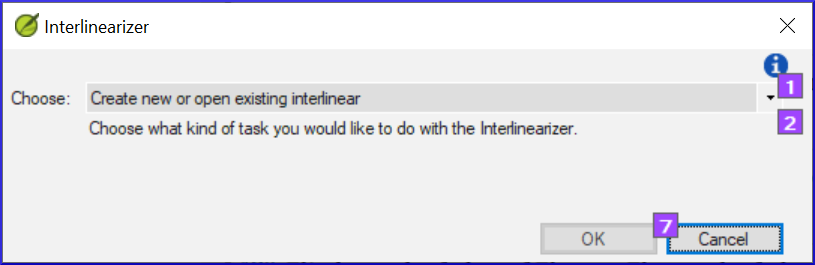
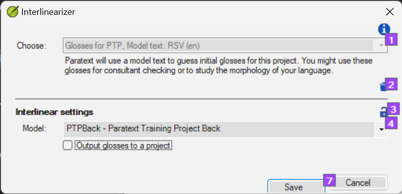
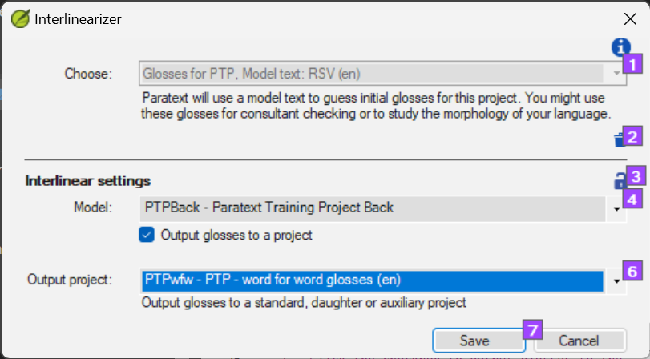
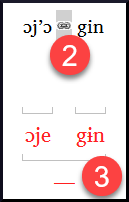

On this page

# 17. Interlinearize a project

**Introduction** The previous module explained how to create a back translation that expresses what a reader understands when he reads or hears the text. There is another type of back translation that is sometimes used and that is a word-for-word style back translation. Some consultants may ask for this style of back translation. If you need to make one of these, you can use Paratext’s project Interlinearizer function.

> **Warning:** Please note that in Paratext 9 you can only use the Interlinearizer on registered projects.

**Before you start:** You have typed, checked, and revised your translation in Paratext and are now preparing for a consultant check by doing a word-for-word back translation. If you want to export the interlinear to a separate project, then before you can start, your administrator must have created a separate project for your word-for-word back translation. [This is separate from the readable back translation in the previous module.]

**Why this is important:** Your consultant needs to have a copy of your translation in a language they can understand. The back translation done in the previous module is very useful, but there are times when a literal translation is more helpful.

**What you will do:** You will use the project interlinearizer to produce a word-for-word gloss of the text. Firstly, you will set up the interlinearizer and then correct any errors. The computer's initial guesses are often wrong, but it learns as it goes and becomes quite accurate quickly. The idea is for the gloss to be correct even though the word order is not correct. When you are happy with the verse, you can approve the glosses and move to the next verse with unapproved glosses.

## 17.1 Configure the project interlinearizer[​](#85a79610577747e588eb6de3f3764b58 "Direct link to 17.1 Configure the project interlinearizer")

1. Click in your project
2. **≡ Tab**, under **Tools** > **Interlinearizer**

   
3. Click to drop down the list [1].
4. Choose to create glosses based on a model text. This is usually your reference text or your free back translation project [2].

### Export glosses to a project[​](#187c0a7da78942f085a0b0ce7cd23c79 "Direct link to Export glosses to a project")

1. If necessary, click the lock icon [3] to unlock the settings.
2. Choose your model text [4].

   
3. Click the checkbox to output glosses to the project that the administrator created
4. Choose the output project created by your administrator

   
5. Click **OK**

## 17.2 Correct the interlinearized text[​](#5692bdbcfc5e493e9eaca52bf0dbcaa0 "Direct link to 17.2 Correct the interlinearized text")

To correct glosses

1. Click the incorrect gloss
   - *A list is displayed*.
2. Either click on the correct gloss in the list
   - *or type the correct gloss in the textbox*
3. Click **Enter**

## 17.3 Translate/gloss a phrase[​](#5dcf6d99cb4c4653a4d3426c32e41623 "Direct link to 17.3 Translate/gloss a phrase")

1. Click between two words
2. Click the chain icon **(Link words)**
3. Click the red line
4. Type the gloss

## 17.4 Add extra words[​](#397336e9e1e34f43953ba179210b763c "Direct link to 17.4 Add extra words")

1. Click in the space between two glosses
2. Type the extra word(s)

## 17.5 Specify the morphology – break a word into morphemes[​](#4be396e96f22469ea459ab6501e55386 "Direct link to 17.5 Specify the morphology – break a word into morphemes")

1. Click on the word in the translation line (top line)
2. Click **Add word parse**
3. Add **spaces** to separate the morphemes and add **+** prefixes and suffixes (see guide)
4. Click **OK**

## 17.6 Approve and Export the text[​](#9295ee6e6c294b8591bbab695a814ea1 "Direct link to 17.6 Approve and Export the text")

When you approve and export the text, any remaining red glosses will be approved.

1. Click **Approve glosses**
2. To continue, click **Next Unapproved Verse**

## 17.7 Help[​](#192a271a080f459886a47400bde27014 "Direct link to 17.7 Help")

For more help on using the Interlinearizer function see the following topics in the Paratext Help:

1. Introduction to Project Interlinearizer
2. How do I open the Project Interlinearizer?
3. How do I generate an interlinear back translation?
4. How do I create a back translation project with the Interlinearizer?
5. How do I create a text revision/adaptation project with the Interlinearizer?
6. What do the colours of glosses mean in the Interlinearizer?