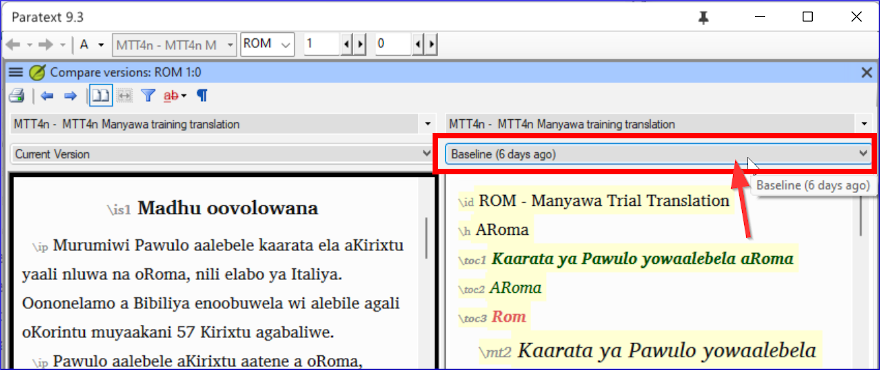
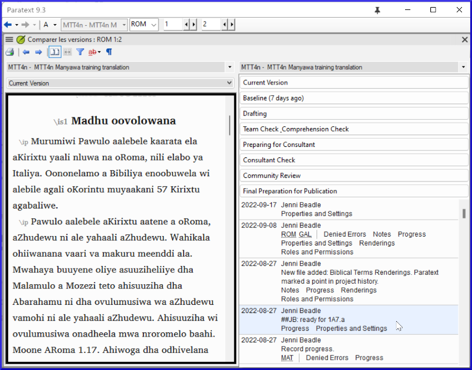
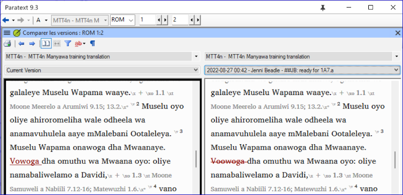

On this page

# 18. Compare Text

**Introduction** In this module, you will learn how to save your text at various points and review them later.

**Before you start** You have worked on your text and you have arrived at an important stage of your project.

**Why is this important?** As you work on your translation, you will be continually making changes. It is good to have a copy of your text as it was at a particular point, for example as it was before you went to a consultant check.

**What will you do?** You will mark a point in the history of the project. Later you can compare the text at different points.

### 18.1 Mark Point in History[​](#6bc0d79911234870b4fe00d7193f8414 "Direct link to 18.1 Mark Point in History")

1. Click in your project window to make it active (in Paratext).
2. **≡ Tab** under **Project** > **Mark a point in project history**
3. Type a comment to describe the point.
4. Click **OK**

> **Tip:** It is good to start the comment with some symbols, like **##**, to easily identify the points you have added in the long list of automatic points that Paratext creates.

### 18.2 Compare Two Versions[​](#b1533bd8ac644603a394e939685a6d4a "Direct link to 18.2 Compare Two Versions")

> **Tip:** Any text that has been deleted is crossed out. Any text that has been added is red or underlined.

- **≡ Tab** expand the menus then under **Project** > **Compare Versions**

- Click on the base version dropdown list
  - *A list of versions is displayed*.

- Choose the desired point in the history
  - *The screen shows the differences*.

