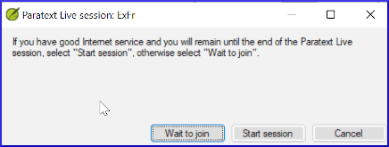
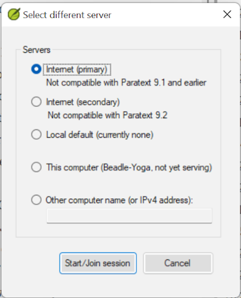
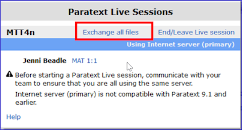

On this page

# 20. Collaboration-tools

> **Warning:** Paratext Live changed in Paratext 9.3.

**Introduction** In this module you will use Paratext Live as a way that the team can collaborate together so that everyone can see the changes to the text on their own computers.

**Before you start** We have already seen how to collaborate with Send/Receive. There are times, for example during a consultant check, when several people need to look at the same text, and perhaps edit it together. Paratext Live allows everyone to look at the text on their own computer and see the changes in real time.

**Why this is important** There are several other ways to let everyone look at the same text. But Paratext Live not only lets everyone see the text, but it also allows more than one person to edit the text.

**What are you going to do?**

- Connect all users to the same network.
- Send/Receive.
- Start Paratext Live and join a session
- Edit the document
- Exchange all files
- Exit Paratext Live
- Send/Receive

> ℹ️ **Note**
> > ℹ️ **Note**
> > info
> 
> > ℹ️ **Note**
> > [4.1 Collaboration Tools](https://vimeo.com/641947293) The video has been revised for Paratext 9.3.

> **Tip:** You may want to try switching to screen sharing (using a tool like Skype or Zoom) while working on spelling, Biblical terms, etc, so everyone can see the changes. And then switch back to using Paratext Live as it requires lower bandwidth.

> ⚠️ **Warning**
> > ℹ️ **Note**
> > Upgrade
> 
> > ℹ️ **Note**
> > Paratext 9.3 allows you to choose a server. Everyone in a particular live session still needs to use the same server (either Primary or Secondary), it is just that from 9.3 you can work with someone on 9.1 or someone else on 9.2 (**just not at the same time**.)

## 20.1 Paratext Live[​](#cfbebfcb20e14db89426a01336737f92 "Direct link to 20.1 Paratext Live")

> **Tip:** All users do not need to do a **send/receive** before starting but if Paratext detects too many changes it will advise that you do a send/receive. Everyone must be connected to the same network.

### Connect to the same network[​](#8778ba22200442839f4c522b484c84a0 "Direct link to Connect to the same network")

Paratext Live can use

- Internet
- a local network
- offline WiFi router
- hotspot with mobile data disabled.

## Start Paratext Live[​](#2e0fa70f644940e48f58e61cd2d84e22 "Direct link to Start Paratext Live")

1. Open the **menu** for the project.
2. Under **Tools**, click **Paratext Live**.
3. Or use the icon on the toolbar.
   - *Two choices are displayed*

## Choose the server[​](#b0daa071fd094d97ae558c23c7708d56 "Direct link to Choose the server")

If all users are using 9.2 or above

- You can choose the first option **Internet (primary)** to connect to the Internet.

  - *A dialog box is displayed*

    
- Click either "Wait to join" or "Start session" (to be the host) as appropriate.

  - *A dialog box may be displayed*
  - *If Autosave in Paratext Settings is not on, the Live session will turn it on for the duration of the session.*

If not,

- Choose the second option **Select different server**.

  - *A dialog box is displayed showing the five options.*

    

**Which one do you choose?**

- Choose the first option Internet (primary) if all users have Paratext 9.2 or above
- Choose the second option Internet (secondary) if any user has Paratext 9.0 or 9.1.
- Choose the third option if you are all connected to a local area network and want to use that LAN to connect.
- Click **OK**.

**Start or wait**

- Click **Start/Join Live session**.
  - *Paratext then effectively asks if you are the host (that is, you will remain until the end)*
- If you are **not** the primary editor/host, click **wait**, don’t press cancel as that will cancel your joining the live session.
- If you **are** the host, click **Start Session**.
  - *With a session active, the Paratext Live button is green*

## Sharing changes from Tools[​](#33584bd1b18248b3bc576745a8aba544 "Direct link to Sharing changes from Tools")

All scripture text is shared in Paratext Live. However, changes made with various tools are not shared automatically. Examples of these unshared changes are to spelling status, Parallel passage status, Biblical Terms and their identified renderings, and Notes. To share these changes:

- Click the Paratext Live button on the toolbar,

- Click “**Exchange all files**”
  - *All of the users then receive updates to these files.*

> **Warning:** Changes from all users are shared, but if two people have changed the exact same item differently, only one person’s change will be saved.

## End the Paratext Live session[​](#092ea72d954c4c68a6f1c1fc61a7f15e "Direct link to End the Paratext Live session")

- Click on the Paratext Live icon.
- Choose **End/Leave Live session**.
- If you are the principal editor (host), you will see a message.
- Click **End the session normally**.
- Send/Receive.

> ℹ️ **Note**
> > ℹ️ **Note**
> > info
> 
> > ℹ️ **Note**
> > **For more help**, search for **live** in the search box on the title bar. There are lots of useful topics on Paratext Live.