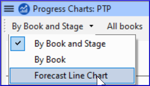

On this page

# 21. Progress report

**Introduction**
In this module you will create a progress report.

**Before you start**
As you have been working on your translation, you have been updating your Assignments and Progress with your progress on completed chapters and books. Now you will prepare a project a report.

**Why this is important**
Your administrators and funders need accurate reports of your progress.

**What are you going to do?**

- Check that your Assignments and Progress is up-to-date.
- Produce several reports.

## 21.1 Check your Assignments and Progress[​](#6e6096ccce1e431a9cd5997eeed7e123 "Direct link to 21.1 Check your Assignments and Progress")

1. Open your project
2. Click on the **Assignments and Progress** icon
3. Update your progress as necessary.

## 21.2 Produce team progress chart[​](#92fecf537c1b45be9afc57099f361f65 "Direct link to 21.2 Produce team progress chart")

1. From the **Tab** menu, under **Project** choose **Progress charts**
2. Click on the dropdown list in the top left.

   
3. Choose as appropriate (e.g. Forecast Line Chart).

   - *A window appears with the graphic*
4. Click the print icon

   - *A window opens*
5. Click the **Print** button

   - *The print dialog is displayed.*
6. Choose your printer (or PDF printer)
7. Click **OK**.