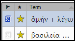

On this page

# 22. Biblical key terms report

**Introduction**
One task in this stage is to produce a report of the changes made in the key Biblical terms.

**Before you start**
In working on your translation, you have identified and changed a number of key Biblical terms.

**Why is this important?**
Although you can’t use Paratext to write the report, it can produce of list of the terms that you have been dealing with and may need to include in your report.

**What are you going to do?**
In the Biblical terms tool, you will filter on the book(s) that you want to include in your report. You will then save the list of the terms as a separate HTML file. You can also filter the list on any discussion notes you may have made.

### 22.1 Biblical terms tool[​](#4623aa1ae72343009f7497174d3c68ca "Direct link to 22.1 Biblical terms tool")

1. Click in your project
2. **≡ Tab**, under **Tools** > **Biblical Terms**
   - If this menu option is not displayed, click on the down arrow at the bottom of the menus to show the complete menus.
3. Set the terms filter
4. Set the verses filter (for the books you have been working on).
5. Sort the list as desired.

### 22.2 Save the list to a file[​](#ea281a10dd8242029b54b4fa3e413408 "Direct link to 22.2 Save the list to a file")

1. **≡ Tab**, under **Biblical terms** > **Export to HTML**
2. Type a name for the file
3. Click **Save**
4. Open the file in **Word/LibreOffice**

### 22.3 Other ways to identify renderings[​](#73e7e3a90122427a8502e3c2df78672f "Direct link to 22.3 Other ways to identify renderings")

**Sort on terms notes**

- Click on the flag icon (first column heading) to sort on Rendering discussion notes.

**Find terms with specific text in the** **rendering description**

1. Click the first filter on the toolbar
2. Choose **Rendering Description**
3. In the text box to the right, type the text to find
   - *The list is filtered.*
4. Save the list to HTML (as above).