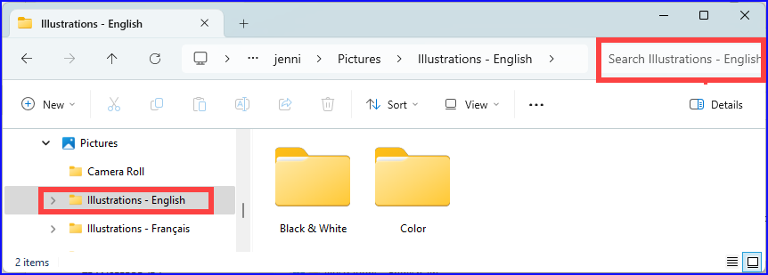
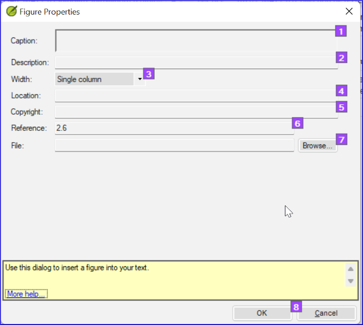
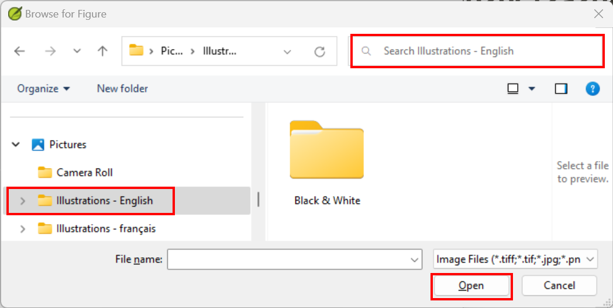
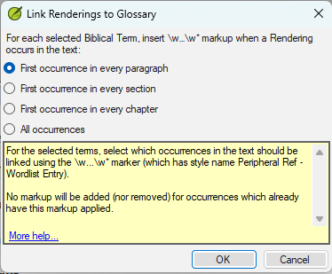

On this page

# 24. Finalising for Publication

**Introduction**
This module looks at the variety of tasks needed to finalise the text for publication.

**What you will do**

- Add **illustrations** and captions
- Identify names for the maps
- Draft Introduction to the NT/Bible
- Check parallel passages
- Verify all checks are complete
- Proper Names final check
- Numbers, money, weights and measures check
- Formatting checks.
- Mark glossary items in the text.

## 24.1 Choosing illustrations and captions[​](#f380fb1fc81e4cbbb72d511558a49bb6 "Direct link to 24.1 Choosing illustrations and captions")

There are over 2800 images available, so it can be difficult to choose illustrations. Fortunately, it is now possible to search for images by chapter reference and by keywords in English. Note that any illustration you insert into Paratext will increase the size of your project. Only add these small jpg files (or alternatively just the file name). When composing, they will be replaced by larger, high-resolution images.

**Create a folder of images to search**

First time:

1. Open the link <https://tiny.cc/sampleimages> on the Internet
2. Right-click on the folder **Illustrations - English**,
3. Select **Download**
   - *It will download about 121MB*.
4. Search and open the downloaded **zip file**.
5. Extract the single folder in the archive: **Illustrations - English** and put it in your **Pictures** folder
   - *(Windows starts to index the contents of the images…)*

**Try various searches**

When your images are indexed, you can try different searches.

1. Open this new folder in the **File Explorer**.

   
2. Type in the search field:
3. **A search word**, like cross, sheep, house, etc.
4. **A Bible reference**, like MAT27, ACT03, etc. (using at least 2 digits for the chapter).
5. Add **black** or **color** to display only black and white images.

## 24.2 Adding illustrations and captions[​](#b8896167ea3a4f46945fbab4670e0e58 "Direct link to 24.2 Adding illustrations and captions")

1. In your project, navigate to the desired verse.
2. From the **Insert** menu, choose **Figure**

   
3. Enter a **caption** to be printed with the image (in your language)[1].
4. Enter a **description** to be printed with the image (in your language) [2].
5. Indicate if the image should fill the width of a column or a page. [3]
6. If applicable, type in a verse range as an acceptable location. [\*][Optional]
7. Enter the necessary copyright information about the image [4]
8. Paratext will fill in the chapter and verse reference that pertains to the image. [5]

**Browse to find the image file**

1. Click **Browse**… to search for the image file. [7]

   - *A dialog box is displayed*.
2. In the dialog, select the **Pictures - Illustrations - English** folder on the left

   
3. Click in the **Search** field (top right) and type to filter the images (as above)
4. Click on the desired image and click on the **Open** button.
5. Click on **OK**.

> **Warning:** To make searching easier, double click on the title bar to **enlarge the window**, **show** the very large icons and **hide the viewing pane**.

## 24.3 Map names[​](#e649bd9a447840cf8dcc7737ef3ba118 "Direct link to 24.3 Map names")

> ℹ️ **Note**
> > ℹ️ **Note**
> > info
> 
> > ℹ️ **Note**
> > A plug-in for doing map names will soon be available (Map Labeler Plugin). In the meantime you can continue with the old system of identifying map names as explained below.

> **Warning:** The Combined NT Maps Biblical Terms list is not a standard list in Paratext 9. It is [**available here**](/img/CombinedNTMapBiblicalTerms.xml): and once downloaded, the file should be copied into "My Paratext 9 Projects"

1. Click in your project.
2. Use the Biblical Terms tool
   **(≡ Tab**, under **Tools** > **Biblical Terms)**
3. Open the liste
   **(≡ Tab**, under **Biblical Terms** > **Select Biblical Terms List)**
4. Choose the list **CombinedNTMapBiblicalTerms**
5. Add renderings for all the names
6. Save the HTML file
   **(≡ Tab**, under **Biblical terms** > **Export as HTML)**
7. Type a name for the file
8. Click **Save**.
9. Fill-in the Word document from the typesetter for the maps.

### 24.4 Draft Introduction to the NT/Bible and the Appendix[​](#8dbe5d1eded645b4b7399b7445e87c9b "Direct link to 24.4 Draft Introduction to the NT/Bible and the Appendix")

1. Change to the book INT
2. Make sure there is an **\h** line
3. Type your introduction using the following markers:
   - **\mt1**
   - **\is**
   - **\ip**
4. Type in the overall introduction to the Bible/NT in the book **INT**

### Appendix[​](#23a598a5fd4080bc92c8c3130afa40e0 "Direct link to Appendix")

- The Appendix/Appendices can be typed in books XXA, XXB, XXC

OR

- One of the specific books: Back Matter (**BAK**), Other Matter **OTH**, Topical Index (**TDX**), Names Index (**NDX**)…

> **Tip:** - Check with your typesetter.

## 24.5 Check parallel passages[​](#41283e7f0e9e4ad0b0cc096515eaea02 "Direct link to 24.5 Check parallel passages")

- See module [PP Compare Parallel passages](/23.PP)

## 24.6 Verify all checks are complete[​](#bad57bb5b1164152978a284244e46078 "Direct link to 24.6 Verify all checks are complete")

**Current book**

1. Open the **Assignments and Progress**.
2. Confirm that there are no issues on any of the checks.

**Several books**

1. Redo the inventories.
2. **≡ Tab** under **Tools** > **Run basic checks.**
3. Make sure all checks are ticked.
4. Make sure all books to be published are chosen.
5. Click **OK**.
6. Correct any errors.

**Word list checks**

From the word list, do the following checks:

1. **≡ Tab**, under **Tools** > **Spell check** > **All checks**
2. **≡ Tab**, under **Tools** > **Find Similar Words**
3. **≡ Tab**, under **Tools** > **Find Incorrectly Joined or Split Words**

## 24.7 Proper Names final check[​](#9848258611574d89b055afe4eb493920 "Direct link to 24.7 Proper Names final check")

1. **≡ Tab**, under **Tools** > **Biblical Terms**
2. **≡ Tab**, under **Biblical terms** > **Select Biblical Terms list** and choose the **Major Biblical Terms** list
3. Filter on names with missing renderings
4. Check that all names have a rendering (add if necessary).

## 24.8 Numbers, money, weights and measures[​](#1ab8c0f85ac14e36ba936d5d546c8dbd "Direct link to 24.8 Numbers, money, weights and measures")

1. Click in your project.
2. **≡ Tab**, under **Tools** > **Biblical Terms**
3. **≡ Tab**, under **Biblical terms** > **Select Biblical Terms list**
4. Choose the appropriate list.
5. Add renderings as usual.

## 24.9 Formatting checks[​](#6468aa6cc0bb4ed7bc531a2111ee63ee "Direct link to 24.9 Formatting checks")

1. Redo the module FC: Formatting checks.
2. **≡ Tab**, under **Tools** > **Checklists** > **Long/short verses**
3. **≡ Tab**, under **Tools** > **Checklists** > **Word or phrase**
4. **≡ Tab**, under **Tools** > **Checklists** > **Section headings**
5. **≡ Tab**, under **Tools** > **Checklists** > **Book titles**
6. **≡ Tab**, under **Tools** > **Checklists** > **References**
7. **≡ Tab**, under **Tools** > **Checklists > Footnotes**

## 24.10 Mark (Link) Glossary Words in the Text[​](#53d0e7fe579147988b0f728b5c2c7b7d "Direct link to 24.10 Mark (Link) Glossary Words in the Text")

It is common to mark words in the printed text with an asterisk when there is a glossary entry for the word/phrase or add a link in the electronic versions. It is recommended to leave this until the end to avoid missing words because of spelling errors. You do this in the Biblical Terms Tool using the Link Renderings to Glossary command.

What about entries in the glossary that are not on the Biblical Terms list? For these, you need to add entries to your project list. This involves finding the word/phrase in the text and creating an entry in your project Biblical terms list. (see [10.7](/10.BT#f683ccf4cdcf45f09c516c09c78ab277)) It is recommended start by doing a few glossary entries at a time.

1. Ensure you have editing permission for all book.
2. In the Biblical Terms tool, select a few glossary entries.
3. **≡ Tab**, under **Edit** > **Link Renderings to Glossary**

   1. The dialog box is displayed.

      
4. Choose **First occurrence in every section**.

   - *Paratext will search through the text and add \w … \w\* markers. Then displays a results list of verses changed.*
5. Carefully check through the results list for errors.

> **Tip:** If there are many unwanted results, you can undo by selecting the entries and choosing **Unlink Renderings to Glossary.**

> **Tip:** - If you have both a phrase and a word, link the longer entry first.
> > - If you have two very different renderings, consider creating a second term in the Biblical Terms Tool.
> > - If you have used "*" in the rendering, carefully review the results and manually delete the \w … \w* from the verse.
> > - Be careful if any Biblical Term rendering is a homograph of a rendering for another Biblical Term.