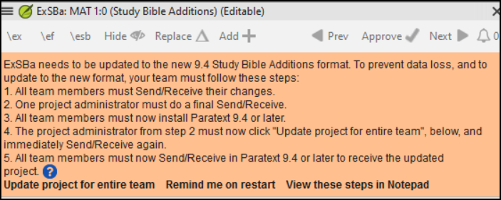
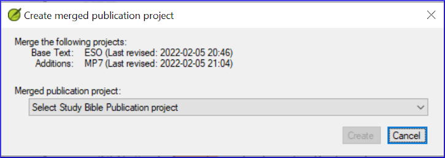

On this page

# Creating a Study Bible with Paratext 9.5

There are a number of improvements to the Study Bible Additions in Paratext 9.5 listed below. These will be further documented in the next edition of the manual.

### Study Bible Additions (SBA) Improvements[​](#1b9598a5fd4080d687aee9efa3c83bfd "Direct link to Study Bible Additions (SBA) Improvements")

- SBA now includes support for **Assignments and Progress** tracking!
- Adds support for displaying **figures in footnotes and sidebars**.
- **Scripture Reference Settings** within SBA projects can now override the settings of the base project.
- Improved **checking features**, ensuring more accurate and efficient review processes.
- It is now possible to add extended notes and sidebars for added or replaced content.
- Base project additional books (GLO, etc.) are incorporated in a SBA project.
- Handling of whitespace and invisible characters is supported in a SBA project.
- Adds an option for the default location of extended note callers.
- SBA-specific spelling discussion notes can be created in the Wordlist.
- Improvements to extracting a Legacy Study Bible into an SBA.

## Paratext 9.4[​](#1b9598a5fd4080ac9c68e321981667bc "Direct link to Paratext 9.4")

This section details the improvements in 9.4. The further improvements in 9.5 have not yet been added below.

> ℹ️ **Note**
> > ℹ️ **Note**
> > info
> 
> > ℹ️ **Note**
> > The **Study Bible Additions (SBA)** features implemented in **9.4 beta** requires that the SBA project be migrated, due to a data format change. The new 9.4 SBA data format is NOT compatible with the PT 9.3 version. In order to use the new SBA features, all project members should move to PT 9.4 beta and the project administrator should migrate the SBA project.

**Introduction** With Paratext 9.2 (and above) you can create a study Bible based on your translation by adding introductory paragraphs, sidebars and detailed footnotes and additional cross-references to help your user have a deeper understanding of the Bible text.

**Where are you in the process?** Before you can create a Study Bible, you will want to translate and consultant check your New Testament (or portions). Then your administrator can create a new project (see below).

**Why is this important?** Study Bible information is created in a separate project with links to the translated text. If the translated text changes the link can be broken. Links can be fixed, but it is less likely to be a problem if the text is stable.

**What will you do?** You (or your administrator) will create a **Study Bible Additions project**. As the name suggests, this is where you can add the study materials (without affecting your translation).

This separate project contains your additional text and a read-only copy of your project. When you are ready, you can merge the Study Bible Additions project with your translation project into a third project.

- Migrate an earlier version of the Study Bible Additions

or

- Create a new project of Study Bible Additions based on your translation
- Register the new project
- Add the additional material (introductions, sidebars, footnotes and cross-references)
- Hide any non-biblical text in the base translation (e.g. headings)
- Merge the projects to create a publication project.

> ℹ️ **Note**
> > ℹ️ **Note**
> > Upgrade
> 
> > ℹ️ **Note**
> > Paratext 9.4 allows you to re-order cross-references, footnotes, and sidebars. For more details, watch [this video on Study Bible additions in 9,4](https://vimeo.com/858761672)

## Migrate an earlier version of the Study Bible Additions[​](#0a743ded6dc24fc399975383664db289 "Direct link to Migrate an earlier version of the Study Bible Additions")

- Open your Study Bible Additions project.

  - A notice is displayed explaining how to migrate your project.

    

## To Create a new Study Bible Additions project[​](#7ed7e93951db49deaf2c5cf7d4d15d70 "Direct link to To Create a new Study Bible Additions project")

1. Use the **Paratext menu** to create a **new project**.
2. Set the **type** of project to **Study Bible Additions**.
3. Choose your translation project for the **“based on” project**.
4. You will need to **register** the new project.
   - *A grey-out read-only copy of your project is displayed, with a toolbar at the top.*

## Add the additional material[​](#e7a1b3e1b97b4eed9be5b9f1c2ed0dcd "Direct link to Add the additional material")

### Introductory material[​](#05a4f1d78d3549d9ac44235760b89873 "Direct link to Introductory material")

1. Position your cursor where you would like the additional material
2. Click **Add +** on the toolbar
3. A blue box with an \ip is added.
4. Type the text.

### Sidebar text[​](#ab2be09dfc0e4fdeb177091e89785b58 "Direct link to Sidebar text")

1. Position your cursor where you would like additional material
2. click **\esb** on the toolbar
   - *A sidebar panel is opened with a \ms marker added*
3. Type the title after the \ms marker
4. Press Enter
5. Choose a marker for the following text.
6. Type the text.
7. Continue as needed.

### Extended cross-reference[​](#cbcab8e8c6a64e38bf737472fe26d8e9 "Direct link to Extended cross-reference")

1. Position your cursor where you would like the cross-reference caller
2. click **\ex** on the toolbar
   1. A footnote panel is opened with a \ex markers added
3. Type in the cross-reference.

### Extended footnote[​](#864c186270064955922ed758dc7d9fcf "Direct link to Extended footnote")

1. Position your cursor where you would like the additional footnote
2. click **\ef** on the toolbar
3. A footnote panel is opened with the appropriate \ef markers
4. Add footnotes as needed.

### Hide non-scriptural material[​](#8fff7769e5ae4060b0f1ffef9a979a79 "Direct link to Hide non-scriptural material")

You can hide non-scriptural material such as headings from the translation

1. Position your cursor where you would like the additional footnote
2. Click **Hide** on the toolbar
   - *The text is displayed in a greyed-out box.*

## Merge the projects to create a publication project[​](#23a03d9d683240a6a21290721a8dbb93 "Direct link to Merge the projects to create a publication project")

To publish the study Bible, you need to create a publication project.

1. Click the Project menu of the Study Bible Additions project
2. Choose “Create merged publication project”

   
3. Click the dropdown list “**Merged publication project**”.
4. Create a new project or choose a previous project
5. Click **Create**

   - *Paratext merges the translation project and the Study Bible Additions project and displays the Merged publication project.*
6. If necessary change the view to **Preview**.

### Making changes[​](#9bd2afcdbf5946038a9b70561fcebc5d "Direct link to Making changes")

You now have three projects.

1. Your original translation project,
2. The Study Bible Additions project and
3. The Merged publication project.

- *Any corrections to the translation* should be made to the *original translation project*.
  - These corrections will be updated in the Study Bible Additions project when you next recreate the merge publication project.
  - *Any corrections to the Study Bible material* should be made in the *Study Bible Additions project*.
- The *merged publication project* is read-only and cannot be changed.
  - To update the changes, recreate the merged publication project again.

## Study Bible Additions project - Compare versions[​](#7b7d078eecd44a71ae7fa6217ba07218 "Direct link to Study Bible Additions project - Compare versions")

In Paratext 9.3 (and above), you can now Compare versions

1. Open a Study Bible Additions project
2. From the **Project** menu,
3. Under **Project**, choose **Compare Versions**
   - *The changes in the additions are displayed*.

## Printing the Study Bible with PTXPrint[​](#cfc9e16b905c4aa48c7aad34c7c5ef9a "Direct link to Printing the Study Bible with PTXPrint")

PTXPrint version 2.1.x (and above) can print the merged publication project. For detailed instructions, see <https://software.sil.org/ptxprint/how-to-study-bible-layout/>