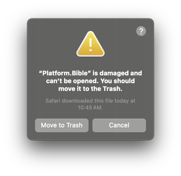

# paranext-core

Extensible Bible translation software

<div align="center">
  
</div>

<div align="center">

[![Build Status][github-actions-status]][github-actions-url]
[![CodeQL][gitghub-codeql-status]][gitghub-codeql-url]
[![Github Tag][github-tag-image]][github-tag-url]

</div>

## Summary

Platform.Bible is extensible Bible translation software. Its functionality is provided almost completely by extensions in order to be very powerful and flexible, giving developers the freedom to create and to share their desired Bible translation experience.

This repository contains the core Platform.Bible software (Electron client, extension host including "PAPI", and .NET library) and the extensions that come bundled with it. There are many other repositories containing additional extensions.

## Users

This software is not yet ready for users. We'll update here with where you can install it when it is ready.

If you would still like to try it, you can [download early releases here on GitHub](https://github.com/paranext/paranext-core/releases).

### Linux Users

To use `.AppImage` files in Linux, [install FUSE](https://github.com/AppImage/AppImageKit/wiki/FUSE) (you only need to do this once), for example, on Ubuntu (>= 22.04):

```bash
sudo apt install libfuse2
```

Then simply [execute/run](https://github.com/AppImage/AppImageKit/wiki) the `.AppImage` file, which you can download from [Releases](https://github.com/paranext/paranext-core/releases).

### Mac Users

If you download and run the ARM release of Platform.Bible from [a computer running Apple Silicon](https://support.apple.com/en-us/116943), you will likely encounter a warning from Apple's Gatekeeper stating that "Platform.Bible is damaged and can't be opened. You should move it to the Trash." or something very similar:



Unfortunately, this is the message Apple chose to display for ARM applications that are not signed (including Platform.Bible, since we have not yet set up application code signing on Mac).

If you trust Platform.Bible and would like to run it even though it is not code signed, you will need to run the following terminal command every time you install a new version of it:

`xattr -c /Applications/Platform.Bible.app`

[`xattr -c` clears all attributes on the provided file](https://ss64.com/mac/xattr.html). Running this command removes all attributes on the currently-installed Platform.Bible application file including the quarantine flag Gatekeeper puts on unsigned ARM applications downloaded from the internet.

## Developer Install

Set up pre-requisites for building:

### Linux Development Pre-requisites

Add the system libraries needed for Electron, [Build Instructions (Linux)](https://www.electronjs.org/docs/latest/development/build-instructions-linux).

### macOS Development Pre-requisites

macOS doesn't come preinstalled with all the
[icu4c](https://unicode-org.github.io/icu/userguide/icu4c/) libraries. They must be
installed separately to provide Unicode support to our .NET code. Platform.Bible is
configured to expect those libraries to be installed using
[MacPorts](https://www.macports.org/). The
[icu package on MacPorts](https://ports.macports.org/port/icu/) has the icu4c
libraries needed for icu.net to run properly.

The build processes are configured to automatically download and package icu4c
libraries with the application, but for development this has to be done manually.

The .NET data provider is configured to automatically copy the icu4c `dylib`s into
its build output directory. If for some reason you need to disable that, you will
need to set an environment variable for the OS to find them. For example:

```bash
export DYLD_FALLBACK_LIBRARY_PATH="$HOME/lib:/usr/local/lib:/usr/lib:/opt/local/lib"
```

If you need to set environment variables like the above, consider adding them to
your `.zprofile` so you don't have to remember to do it manually.

### All Platforms Development Pre-requisites

Install [`Node.js` version >=18.0.0](https://nodejs.org/) (18.0.0 or greater is required for using `fetch`). We recommend using [Volta](#javascript-tool-manager).

Install `dotnet` [.NET 8 SDK from here](https://learn.microsoft.com/en-us/dotnet/core/install/).

To check if `dotnet` is installed run (ensure you have a v8 SDK):

```bash
dotnet --version
dotnet --list-sdks
```

### Cloning and installing dependencies (all platforms)

Clone the repo and install dependencies:

```bash
git clone https://github.com/paranext/paranext-core.git
cd paranext-core
npm install
```

To build the declaration type file `papi.d.ts` for extensions to use, run the following:

```bash
npm run build:types
```

## Starting Development

Start the app in the `dev` environment:

```bash
npm start
```

After you run `npm start` (or, in VSCode, launch `Debug Paranext Core`), you can edit the code, and the relevant processes will hot reload.

### Developing Extensions

Paranext Core extensions are found in the `extensions` folder. Please follow the instructions in
`extensions/README.md` to develop extensions.

Please see the [Extension Template wiki](https://github.com/paranext/paranext-extension-template/wiki) for guides on developing extensions.

## GitHub Pages

**[Platform.Bible API Documentation](https://paranext.github.io/paranext-core/papi-dts)**

- Explore the declarations of types available on the PAPI.

**[Platform.Bible React Components and Hooks Documentation](https://paranext.github.io/paranext-core/platform-bible-react)**

- Check out the React components and hooks available to use.

**[Platform.Bible Utilities Documentation](https://paranext.github.io/paranext-core/platform-bible-utils)**

- Check out the utility functions, types, and classes available to use.

## JavaScript Tool Manager

You can use [Volta](https://volta.sh/) with this repo to use the right version of tools such as **node** and **npm**.

If you don't use Volta just look at the `volta` property in [package.json](https://github.com/paranext/paranext-core/blob/main/package.json) to see the right tool versions to install in your preferred way.

## Packaging for Production

To package apps for the local platform:

```bash
npm run package
```

## Publishing

1. Create a branch of the form `release/*`, e.g. `release/v1.2.3`, or `release/v1.2.3-rc1`.
2. Update the _version_ in your project's `release/app/package.json`, e.g.:
   ```bash
   cd ./release/app
   npm version 1.2.3
   ```
3. Create a new draft [GitHub **Release**](https://docs.github.com/en/repositories/releasing-projects-on-github/managing-releases-in-a-repository). Ensure the following are included:
   - a _Tag version_, e.g. `v1.2.3`, choose _Create new tag on publish_.
   - set the **Target** to the release branch.
   - a copy of the change log. Click **Generate release notes** as a starting point.
   - Click **Save draft**.
4. Update `CHANGELOG.md` with changes in this release from the GitHub draft **Release**.
5. Commit these changes to your release branch and push the commit to GitHub.
6. Once the GitHub build **Action** has finished, it will add build artifact files to the draft release. Remove the `.blockmap` files and leave the `.yml` files and the installers and executable, e.g. `.exe` on Windows.
7. Publish the release on GitHub.
8. Merge the release branch back into **main** with a merge commit.

## Testing

The following tests run automatically on each GitHub PR (see [test.yml](https://github.com/paranext/paranext-core/blob/main/.github/workflows/test.yml)).

To run C# unit tests:

```bash
cd c-sharp-tests
dotnet test
```

To run C# unit tests watching for file changes:

```bash
cd c-sharp-tests
dotnet watch test
```

To run all TS unit tests:

```bash
npm test
```

To run an individual TS unit test watching for file changes:

```bash
npm test -- <path/to/test-file.test.ts> --watch
```

You can also use the [recommended VS Code extensions](#vs-code-extension-options) to run tests there.

## Storybook

To run Storybook locally:

```bash
npm run storybook
```

To build Storybook:

```bash
npm run storybook:build
```

To run Storybook as a web app, after it was built successfully:

```bash
npx http-server ./storybook-static
```

## Windows Development with WSL2

On Windows, you can install [WSL](https://learn.microsoft.com/en-us/windows/wsl/) (Windows Subsystem for Linux) so you can test cross-platform compatibility on Linux (as well as Windows). You'll need to use a Linux distribution with WSL2 (rather than WSL1) so the X-Server windows can be opened for Electron.

1. Here is how to [install Linux on Windows with WSL](https://learn.microsoft.com/en-us/windows/wsl/install).
2. You'll want to follow that by setting up to use **VS Code**, **Git** and **NodeJS** with WSL. See the various [tutorials](https://learn.microsoft.com/en-us/windows/wsl/setup/environment).
3. In the WSL distribution, add system libraries needed for Electron, see [Linux Development Pre-requisites](#linux-development-pre-requisites) above.
4. In the WSL distribution, clone the repo as described above under [Developer Install](#developer-install).

You'll be running a copy of the repo in both Windows and WSL so make sure they are both up-to-date.

You can use VS Code from your host to access code in your WSL repo clone using the Microsoft [Remote Development](https://marketplace.visualstudio.com/items?itemName=ms-vscode-remote.vscode-remote-extensionpack) VS Code extension.

## VS Code Extension Options

Extensions highly recommended for this repo are already displayed in VS Code through the [Extensions Recommendations settings](https://github.com/paranext/paranext-core/blob/main/.vscode/extensions.json). These are optional extensions that our developers enjoy using:

- [TODO Highlight](https://marketplace.visualstudio.com/items?itemName=wayou.vscode-todo-highlight)
- [Version Lens](https://marketplace.visualstudio.com/items?itemName=pflannery.vscode-versionlens)

## Formatting and Linting

Formatting happens automatically when you commit. If you use VS Code with this repo's recommended extensions it will format when you save.

To check TypeScript for readability, maintainability, and functionality errors, and to check a few other files for proper formatting, run the following from the repo root (or just use VS Code with this repo's recommended extensions)

```bash
npm run format
npm run lint
```

To check C# for readability, maintainability, and functionality errors, run the following from the repo root (or just use VS Code with this repo's recommended extensions)

```bash
cd c-sharp
dotnet tool restore
dotnet csharpier .
```

## Documentation in `papi.d.ts`

VSCode renders JSDoc comments in the UI to make it easier for developers to use functions and properties as intended. However, those comments do not always propagate from modules to the `d.ts` type definition file when those modules are re-exported. To help with this problem in `papi.d.ts` that we export for extensions to reference, we added some custom functionality.

If you want comments to be copied from one location in `papi.d.ts` to another, do the following:

- In the JSDoc comments that you want copied elsewhere, add "JSDOC SOURCE myServiceName" (must have a blank line after) in the JSDoc comments like this:

```typescript
/**
 * JSDOC SOURCE myService
 *
 * myService is amazing. Here are more details about it.
 * ...
 */
const myService = {
  ...
}
```

- In the location where you want the docs copied, add "JSDOC DESTINATION myServiceName" like this:

```typescript
const papi = {
  ...
  /** JSDOC DESTINATION myService */
  myService,
```

## Thanks

Some important decisions in this project were inspired by the work done in [Visual Studio Code](https://code.visualstudio.com/api). Thanks VS Code developers for some great ideas!

## License

This project is licensed under the [MIT License](./LICENSE).
Copyright © 2017-2025 [SIL Global](https://www.sil.org/) and [United Bible Societies](https://unitedbiblesocieties.org/)

<!-- define variables used above -->

[github-actions-status]: https://github.com/paranext/paranext-core/workflows/Test/badge.svg
[github-actions-url]: https://github.com/paranext/paranext-core/actions
[gitghub-codeql-status]: https://github.com/paranext/paranext-core/actions/workflows/codeql-analysis.yml/badge.svg
[gitghub-codeql-url]: https://github.com/paranext/paranext-core/actions/workflows/codeql-analysis.yml
[github-tag-image]: https://img.shields.io/github/tag/paranext/paranext-core.svg?label=version
[github-tag-url]: https://github.com/paranext/paranext-core/releases/latest
