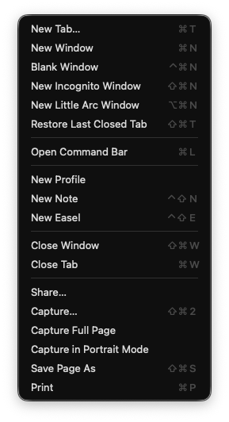

import { Meta } from '@storybook/addon-docs/blocks';

<Meta title="Guidelines/Ellipses" />

# Ellipses

We have two rules about using ellipses on buttons and menu items
1. Use a proper ellipsis character `…` (U+2026), not three dots `...`.
2. Only add an ellipsis if it won't *do* an action immediately and there will be a chance to cancel.

## Ellipsis character
Make sure to use a proper ellipsis character, not three consecutive periods.
{/* WARN: Storybook have a [known limitation](https://storybook.js.org/docs/faq#why-arent-my-code-blocks-highlighted-with-storybook-mdx) for syntax highlighting code blocks and are pursuing a fix. */}
```diff
- Open... // Don't use three periods
+ Open…   // Use ellipsis (U+2026)
```


## What an ellipsis means
Conventionally, an ellipsis means an action will be interrupted by a choice and not done immediately.

|        | Label without an ellipsis                                                                                               | Label ending with an ellipsis                                                                                                                                           |
| -------------------- | --------------------------------------------------------------------------------------------------------- | -------------------------------------------------------------------------------------------------------------------------------------------------- |
| **Means**                | Do immediately.                                                                                           | Do after a choice. You'll have a chance to back out.                                                                                           |
| **Example**              | **New tab**                                                                                                   | **Open…**                                                                                                                                              |
| **On click** | Immediately opens a new tab. There will be choices to make, but the tab will already exist at that point. | Opens a dialog to choose a file. **Cancel** will result in no action. Choosing a file and clicking **Open** will result in opening a file immediately. |

The grey area is that a great number of actions, especially navigation, are met by choices on the other end. In the above example, when a user makes a **New tab**, the tab is populated with choices for what to view. But at that point, the tab already exists, and there is no way to cancel the action, so the menu item's label doesn't end with an ellipsis.

To remember, lean strongly into the idea of "needs additional information" in a grammatical sense. These examples need ellipses because they need more info to complete the phrase:
* View > View as… (View as what!?)
* File > Open… (Open what!?)

In these examples, *nothing* can be done until the user provides an object to fill in the ellipsis.

In contrast, the following examples do **not** need ellipses
* Paratext 10 \
  **Help** > **About Paratext 10 Studio**
* In Figma \
  **File** > **Open File Browser** \
  Opening the file browser completes the action, so there's no missing info and no ellipsis needed.
* On macOS \
  **Apple** > **System Settings**
* In Arc browser \
  **File** > **Capture Full Page** \
  Notice that **Capture Full Page** provides the object of "capture" but "Capture…" has no object to complete the verbal phrase, so it needs an ellipsis. \
  


### Historical context of ellipsis
There used to be a lot more ellipses used in commands and menu items; Paratext's policy on ellipses should result in fewer than older applications.

Here's an example of a menu item that conventionally gets an ellipsis but wouldn't according to our policy. 
```diff
- Paratext > Settings… // old convention
+ Paratext > Settings  // new
```

At the time of writing this article, while the English localization of "Settings" in Paratext 10 doesn't use an ellipsis (and it shouldn't), the Spanish localization does (and it also shouldn't!).
```diff
// es.json
- "%mainMenu_settings%": "Configuración...", // non-compliant
+ "%mainMenu_settings%": "Configuración",

// en.json
+ "%mainMenu_settings%": "Settings", // fits policy
```

The ellipsis after **Settings** is so pervasive that in an audit of 20 macOS applications, every app used "Settings…" with an ellipsis. This convention is standardized by the [Apple Human Interface Guidelines](https://developer.apple.com/design/human-interface-guidelines/the-menu-bar#App-menu). This would be a good reason to make an exception, and we may choose to do so in the future.

