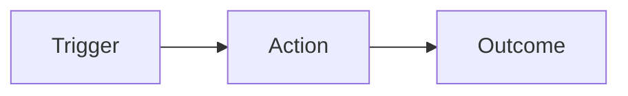
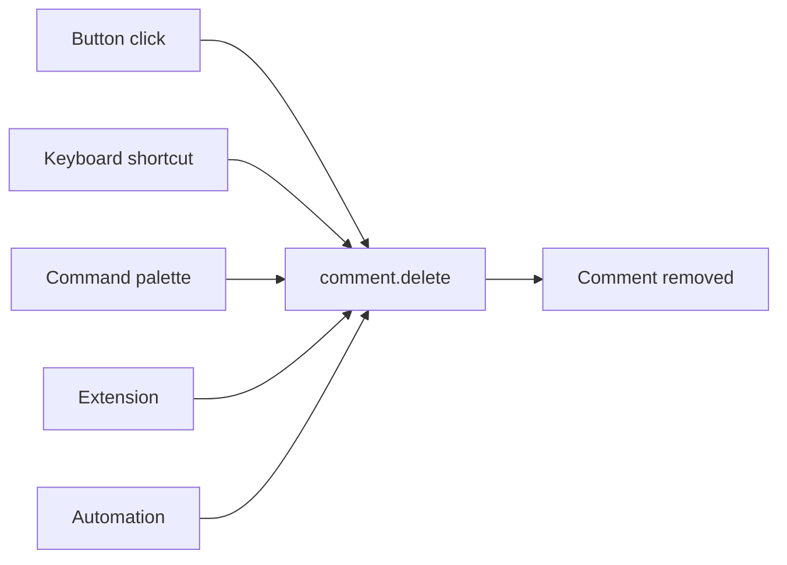

import { Meta } from '@storybook/addon-docs/blocks';
import { Button } from '@/components/shadcn-ui/button';
import {
  Command,
  CommandEmpty,
  CommandGroup,
  CommandInput,
  CommandItem,
  CommandList,
  CommandShortcut,
} from '@/components/shadcn-ui/command';
import {
  ContextMenu,
  ContextMenuContent,
  ContextMenuItem,
  ContextMenuShortcut,
  ContextMenuTrigger,
} from '@/components/shadcn-ui/context-menu';
import { Trash2, MousePointerClick, Keyboard, Puzzle, Bot, Terminal } from 'lucide-react';
import { ExampleBlock, ExampleBlockGroup } from '@/storybook/example-block.component';

<Meta title="Guidelines/Triggers and Actions" />

# Triggers, actions, and outcomes

UI elements are not the action themselves. A button, a keyboard shortcut, a menu item, an extension, an automation, or an API call are all just _triggers_ for an underlying action. The action owns the behavior, state changes, and side effects — and the action produces the outcome.

This article describes that mental model and how to apply it consistently across Platform.Bible.

---

## Core idea

The cleanest mental model is **trigger → action → outcome**.

- A **trigger** is _how_ the user or system starts something.
- An **action** is the canonical unit of behavior — one named, addressable thing.
- An **outcome** is what actually changes in the interface or data.

Separating these layers keeps behavior consistent even when the same thing can be initiated by clicking, keyboard input, menus, voice, scripts, or background processes. Users build expectations around what the system "means" and how it responds; when the same action behaves the same way regardless of how it was triggered, the product feels predictable and easier to learn.

  

    

      Trigger
    

    →
    

      Action
    

    →
    

      Outcome
    

  

  

    The action is the only layer that defines behavior. Triggers are interchangeable; outcomes are
    a result, not a definition.
  

---

## Many triggers, one action

There is no fixed limit on how many triggers can invoke an action. A single action — say, `comment.delete` — should be reachable from every place where it makes sense:

  

    

      

        <MousePointerClick className="tw-h-3.5 tw-w-3.5" /> Button click
      

      

        <Keyboard className="tw-h-3.5 tw-w-3.5" /> Keyboard shortcut
      

      

        <Terminal className="tw-h-3.5 tw-w-3.5" /> Command palette
      

      

        <Puzzle className="tw-h-3.5 tw-w-3.5" /> Extension
      

      

        <Bot className="tw-h-3.5 tw-w-3.5" /> Automation
      

    

    

      →
    

    

      Action
      <code className="tw-mt-1 tw-text-sm tw-font-medium tw-text-primary">comment.delete</code>
    

    

      →
    

    

      <Trash2 className="tw-h-3.5 tw-w-3.5" />
      Comment removed
    

  

The user may see different affordances, but the permission checks, confirmation flow, optimistic UI, telemetry, and error handling all live in one place.

---

## UI is a trigger, not the behavior

The strongest practical version of this principle is: **the UI describes available actions; it doesn't embed them.** A button knows _which_ action to invoke and _when_ it is available — not _how_ the action runs.

<ExampleBlockGroup>
  <ExampleBlock
    variant="dont"
    code={`function DeleteCommentButton({ commentId }) {
  return (
    <Button
      onClick={async () => {
        if (!confirm('Delete this comment?')) return;
        await api.delete(\`/comments/\${commentId}\`);
        toast.success('Comment deleted');
        analytics.track('comment_deleted', { source: 'button' });
      }}
    >
      Delete
    </Button>
  );
}`}
  >
    Behavior is welded to the button. A keyboard shortcut, context menu, or extension that wants
    the same outcome must duplicate the confirmation, request, toast, and analytics — and they
    will drift.
  </ExampleBlock>

  <ExampleBlock
    variant="do"
    code={`function DeleteCommentButton({ commentId }) {
  const { invoke, isAvailable } = useAction('comment.delete');
  return (
    <Button onClick={() => invoke({ commentId })} disabled={!isAvailable({ commentId })}>
      Delete
    </Button>
  );
}`}
  >
    The button is a trigger for <code>comment.delete</code>. Confirmation, network call, toast,
    analytics, and permission checks all live in the action's handler — and every other trigger
    gets the same behavior for free.
  </ExampleBlock>
</ExampleBlockGroup>

The same principle applies in reverse: any place a user might reasonably reach for an action, expose a trigger for it. Discoverability is the UI's job; behavior is the action's job.

---

## The same action from different surfaces

Here is `comment.delete` invoked from a context menu and from the command palette. Each surface presents its own affordance — including a keyboard hint — but both call the same action.

<ExampleBlockGroup>
  <ExampleBlock
    title="Context menu"
    variant="neutral"
    previewClassName="tw-min-h-[180px]"
    preview={
      <ContextMenu>
        <ContextMenuTrigger className="tw-flex tw-h-32 tw-w-64 tw-items-center tw-justify-center tw-rounded-md tw-border tw-border-dashed tw-border-border tw-text-xs tw-text-foreground/60">
          Right-click a comment
        </ContextMenuTrigger>
        <ContextMenuContent>
          <ContextMenuItem>
            Reply
            <ContextMenuShortcut>R</ContextMenuShortcut>
          </ContextMenuItem>
          <ContextMenuItem>
            Edit
            <ContextMenuShortcut>E</ContextMenuShortcut>
          </ContextMenuItem>
          <ContextMenuItem className="tw-text-destructive focus:tw-text-destructive">
            <Trash2 className="tw-mr-2 tw-h-4 tw-w-4" />
            Delete comment
            <ContextMenuShortcut>⌫</ContextMenuShortcut>
          </ContextMenuItem>
        </ContextMenuContent>
      </ContextMenu>
    }
  >
    Right-clicking a comment exposes <code>comment.delete</code> in context.
  </ExampleBlock>

  <ExampleBlock
    title="Command palette"
    variant="neutral"
    previewClassName="tw-min-h-[180px]"
    preview={
      <Command className="tw-w-64 tw-rounded-md tw-border tw-border-border">
        <CommandInput placeholder="Type a command…" />
        <CommandList>
          <CommandEmpty>No results.</CommandEmpty>
          <CommandGroup heading="Comment">
            <CommandItem>
              <Trash2 className="tw-mr-2 tw-h-4 tw-w-4" />
              Delete comment
              <CommandShortcut>⌫</CommandShortcut>
            </CommandItem>
          </CommandGroup>
        </CommandList>
      </Command>
    }
  >
    Searching the palette reaches the exact same action — same confirmation, same outcome.
  </ExampleBlock>
</ExampleBlockGroup>

---

## Behavior lives in the action

Once the UI is just a trigger, _everything else_ — state, loading, disabled rules, success feedback, error handling, permissions, telemetry — moves into the action layer. This is what makes the model pay off.

<ExampleBlockGroup>
  <ExampleBlock
    variant="dont"
    code={`// Logic copied across triggers — they will drift over time.
function onDeleteClick(id) { /* confirm, delete, toast */ }
function onDeleteShortcut(id) { /* confirm, delete, toast */ }
extensionApi.register('deleteComment', (id) => { /* delete, no confirm */ });`}
  >
    Each trigger reimplements the behavior. The shortcut forgot the toast; the extension skipped
    confirmation. There is no single place to fix a bug or add telemetry.
  </ExampleBlock>

  <ExampleBlock
    variant="do"
    code={`actions.register('comment.delete', {
  isAvailable: ({ commentId }) => canEdit(commentId),
  confirm: { title: 'Delete this comment?', destructive: true },
  async run({ commentId }) {
    await api.delete(\`/comments/\${commentId}\`);
    toast.success('Comment deleted');
  },
  telemetry: 'comment_deleted',
});`}
  >
    One handler defines the behavior. Every trigger — button, shortcut, palette, extension,
    automation — gets confirmation, permission checks, telemetry, and consistent feedback.
  </ExampleBlock>
</ExampleBlockGroup>

---

## Tradeoffs to watch

The biggest benefit of this model is consistency. The biggest risk is abstraction that becomes too invisible — teams lose track of where behavior lives.

- **Too loose**, and triggers drift apart. A new shortcut quietly bypasses the confirmation dialog; an extension API skips the permission check.
- **Too rigid**, and the product loses flexibility. A trigger that needs a one-off variation can't get it without forking the action.

A good rule: **centralize behavior, but keep triggers explicit.** Users should be able to discover actions through the UI, while power users and extensions get alternate entry points into the same behavior.

---

## A concise principle

> Every user-facing control is a **trigger**, not the behavior itself. Behavior belongs to a shared **action** that can be invoked from many places.

That framing gives teams a durable way to think about buttons, shortcuts, menus, scripts, extensions, and background processes — without fragmenting the product experience.
